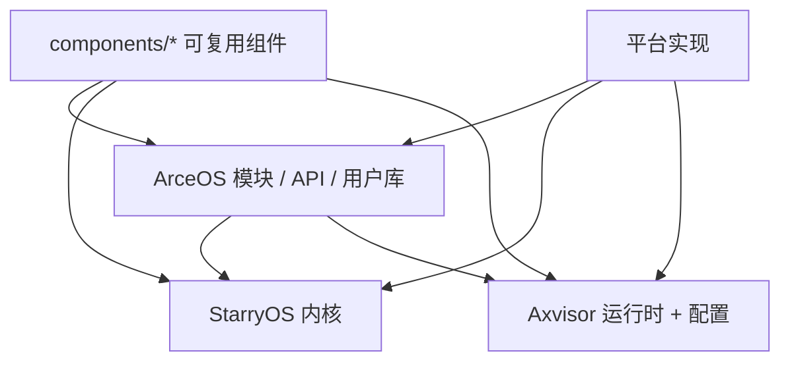

# 系统关系

在当前仓库里，三套系统与组件层之间存在明确的依赖层次。理解这层关系是评估改动影响面和选择验证路径的基础。

## 三套核心系统

### ArceOS - 模块化内核底座

ArceOS 是仓库里最直接的组件化内核基础。很多能力从这里向上游系统扩散：

- **调度与任务管理**：`ax-task`、`ax-sched`
- **内存管理**：`ax-mm`、页表抽象
- **驱动、网络、文件系统**：`ax-driver`、`ax-net`、`ax-fs`
- **用户库与 API 聚合**：`ax-std`、`ax-libc`、`ax-feat`

详细说明：[ArceOS 开发指南](../guides/arceos-guide)

### StarryOS - Linux 兼容系统

StarryOS 建立在 ArceOS 的大量基础设施之上，重点补齐：

- Linux syscall 兼容语义
- 多进程、多线程模型
- 信号机制
- rootfs 用户态程序验证链路

详细说明：[StarryOS 开发指南](../guides/starryos-guide) | [StarryOS 内部机制](../internals/starryos-internals)

### Axvisor - Type-I Hypervisor

Axvisor 是运行在 ArceOS 基础设施之上的虚拟化监视器，依赖：

- 组件层虚拟化能力（`axvm`、`axvcpu`、`axdevice`）
- 运行时配置体系（板级配置 + VM 配置）
- Guest 镜像准备链路

详细说明：[Axvisor 开发指南](../guides/axvisor-guide) | [AxVisor 内部机制](../internals/axvisor-internals)

## 依赖流向图

## 改动影响评估规则

| 改动位置 | 影响范围 | 验证优先级 |
|----------|---------|-----------|
| `components/*` 基础 crate | 三套系统都可能受影响 | 先跑 host 测试，再跑各系统最小路径 |
| `os/arceos/modules/*` | ArceOS -> StarryOS / Axvisor | 先测 ArceOS，再测上层 |
| `os/StarryOS/kernel/*` | 主要影响 StarryOS | 重点关注 rootfs 和 syscall 行为 |
| `os/axvisor/*` | Axvisor 自身 | 代码 + 配置 + 镜像一起验证 |

更系统的组件分层说明：[架构与组件层次](../design/architecture/arch)
