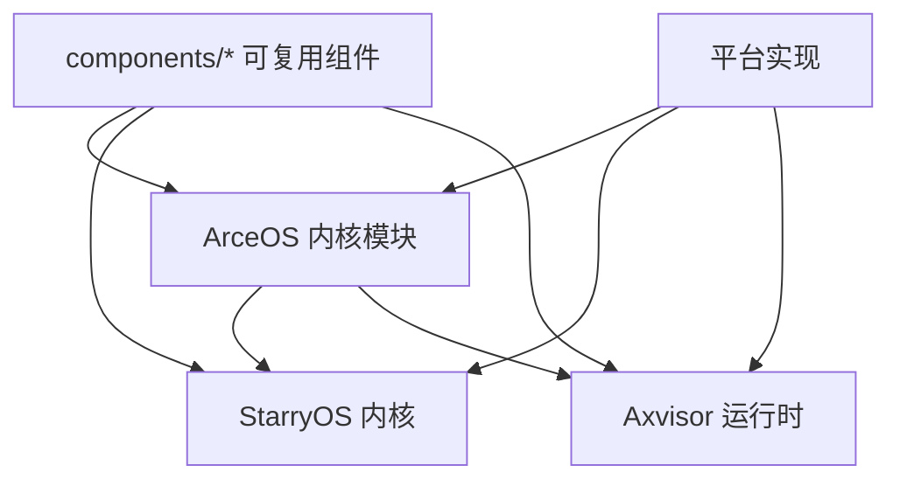

# 项目概览

TGOSKits 是一个面向操作系统与虚拟化开发的统一集成工作区。它通过 Git Subtree 将 **ArceOS** 模块化内核、**StarryOS** Linux 兼容系统、**Axvisor** Type-I 虚拟化监视器以及 140+ 独立组件 crate 汇聚到同一仓库中，使用统一的 `cargo xtask` 入口完成构建、运行、测试和集成验证。

## 核心定位

| 维度 | 说明 |
|------|------|
| **统一工作区** | 三套系统 + 组件层在同一个 Cargo workspace 中协同开发 |
| **组件化架构** | 基础能力以独立 crate 形式存在，可被多系统复用 |
| **统一构建入口** | 根目录 `cargo xtask` 是唯一推荐入口，`cargo arceos` / `cargo starry` / `cargo axvisor` 为便捷别名 |
| **多架构支持** | RISC-V 64 / AArch64 / x86_64 / LoongArch64 |

## 仓库结构

```text
tgoskits/
├── components/                # 独立可复用组件 crate（140+）
├── os/
│   ├── arceos/                # ArceOS 模块化 unikernel 内核
│   ├── StarryOS/              # StarryOS Linux 兼容系统
│   └── axvisor/               # Axvisor Type-I Hypervisor
├── platform/                  # 平台相关实现（QEMU / 开发板）
├── test-suit/                 # 系统级测试套件
├── xtask/                     # 统一构建入口（tg-xtask）
├── scripts/                   # 构建、仓库管理、分析脚本
└── docs/                      # 当前文档站点
```

## 三套核心系统

### <a id="arceos">ArceOS</a>

ArceOS 是仓库中最基础的模块化 unikernel 内核。大量基础能力从这里向上游系统扩散：

- 调度与任务管理、内存管理
- 驱动框架、网络协议栈、文件系统
- 用户库与 API 聚合层

详细开发指南：[ArceOS 开发指南](/docs/design/systems/arceos-guide)

### <a id="starryos">StarryOS</a>

StarryOS 建立在 ArceOS 的基础设施之上，重点补齐 Linux 兼容语义：

- Linux syscall 兼容层
- 多进程、多线程管理
- 信号机制与 rootfs 用户态验证链路

详细开发指南：[StarryOS 开发指南](/docs/design/systems/starryos-guide)

### <a id="axvisor">Axvisor</a>

Axvisor 是运行在 ArceOS 基础设施之上的 Type-I Hypervisor：

- vCPU / VM / 虚拟设备组件化抽象
- 多 Guest 支持（ArceOS / Linux / RT-Thread）
- 板级配置与 VM 配置双层配置体系

详细开发指南：[Axvisor 开发指南](/docs/design/systems/axvisor-guide)
内部机制：[AxVisor 内部机制](/docs/design/architecture/axvisor-internals)

## 组件依赖关系



详细说明：[架构与组件层次](../design/architecture/arch) | [依赖图全量分析](/docs/design/reference/tgoskits-dependency)

## 推荐阅读路径

| 你的目标 | 建议阅读顺序 |
|----------|-------------|
| 第一次进入仓库 | [快速开始](/docs/quickstart/arceos-qemu) → [概览](./overview) → [环境要求](./hardware) |
| 理解命令体系 | [构建流程](../design/build/flow) → [命令总览](../design/build/cmd) |
| 改某个系统 | [系统关系](./guest) → 对应系统指南 (`design/systems/`) |
| 评估组件影响面 | [架构设计](../design/architecture/arch) → [组件开发指南](/docs/design/reference/components) |
| 做 Axvisor 开发 | [Axvisor 指南](/docs/design/systems/axvisor-guide) → [配置体系](../design/guest-config/config-overview) |
