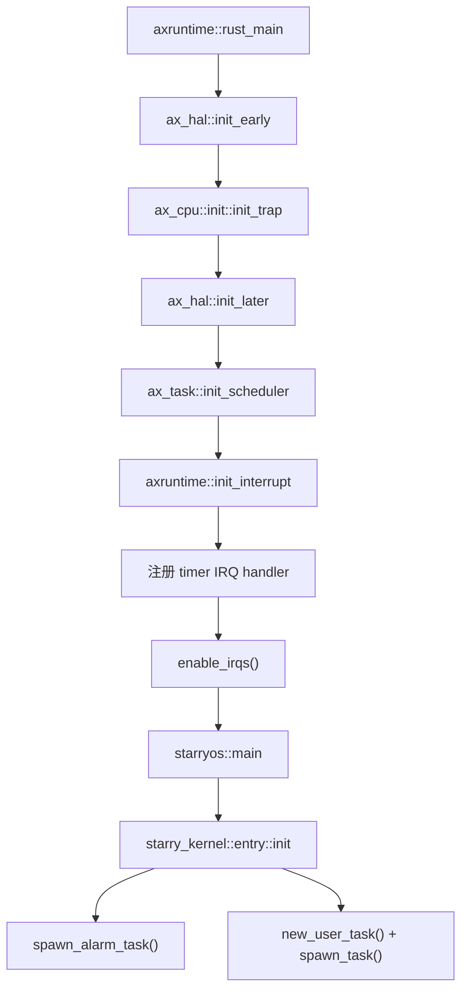
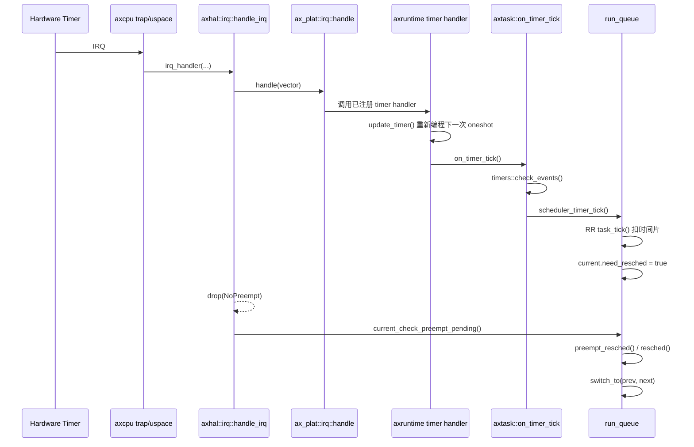
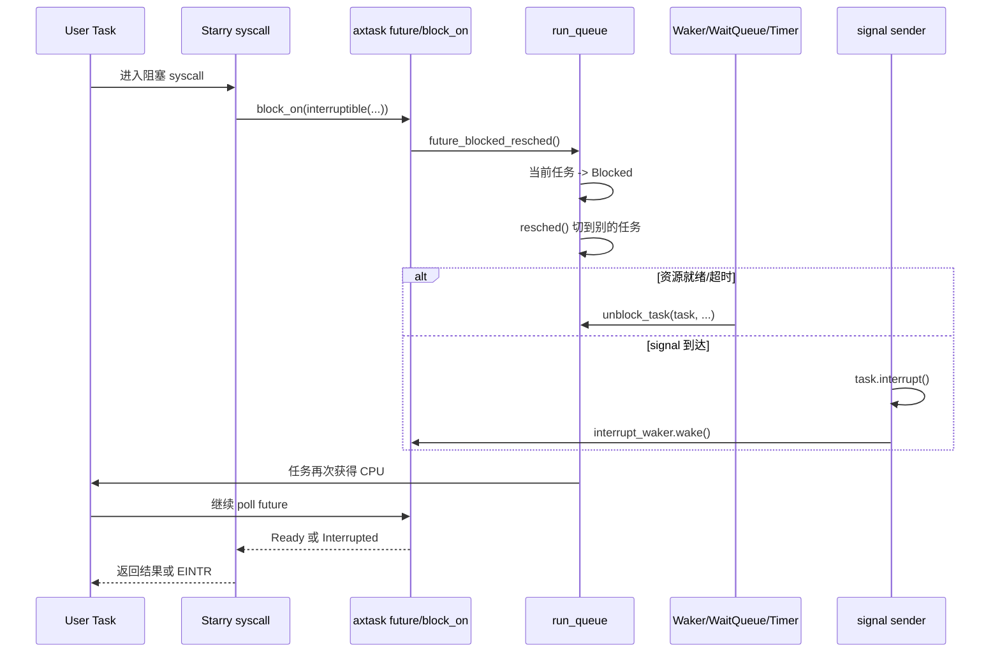
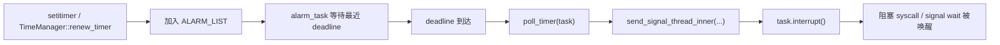

# StarryOS 中断处理与任务调度链条分析

本文基于当前仓库中的 StarryOS 实现，目标是把下面三件事串成一条完整链路：

1. 硬件中断怎样进入内核，并落到具体 handler。
2. 时钟中断怎样推动超时唤醒、抢占和上下文切换。
3. Starry 用户线程怎样在 syscall、signal、阻塞等待、中断后重新回到用户态。

文中提到的“Starry”主要是 `os/StarryOS/kernel`，但真正的执行路径横跨 `axcpu`、`axhal`、`axruntime`、`axtask` 和平台 crate。

## 1. 一句话结论

- StarryOS 自己不直接实现最低层 trap/IRQ 分发；它复用的是 `axcpu -> axhal -> axplat -> axtask` 这条公共链。
- 当前 `starry-kernel` 开启了 `sched-rr`，所以调度器是 RR，时间片由 `axtask` 在 timer tick 中扣减。
- “硬件中断”和“给任务打断”是两层不同语义：
  - 硬件中断来自 trap/IRQ。
  - 任务打断来自 `TaskInner::interrupt()`，本质是一个软件标志，用来让 `interruptible()` future 或阻塞 syscall 尽快返回 `EINTR`。
- 真正把 Starry 语义拼起来的总装配点是用户线程外层循环 `new_user_task()`。

## 2. 关键源码地图

| 主题 | 关键位置 | 作用 |
| --- | --- | --- |
| Starry 用户线程入口 | `os/StarryOS/kernel/src/task/user.rs` | `UserContext::run()` 外层循环，处理 syscall/page fault/interrupt/signal |
| Starry 初始化 | `os/StarryOS/kernel/src/entry.rs` | 挂载伪文件系统、创建 init 用户线程、启动 alarm task |
| Starry 信号/任务打断 | `os/StarryOS/kernel/src/task/signal.rs` | 发送 signal 时调用 `task.interrupt()` |
| Starry 线程定时器 | `os/StarryOS/kernel/src/task/timer.rs` | `ITIMER_*`、alarm task、基于 signal 的超时通知 |
| 运行时 IRQ 初始化 | `os/arceos/modules/axruntime/src/lib.rs` | 注册 timer IRQ handler，建立逻辑 tick |
| 通用 IRQ 分发 | `os/arceos/modules/axhal/src/irq.rs` | `#[irq_handler]` 入口，带 `NoPreempt` guard |
| 任务调度 API | `os/arceos/modules/axtask/src/api.rs` | `yield_now`、`sleep`、`on_timer_tick`、`exit` |
| run queue / 切换 | `os/arceos/modules/axtask/src/run_queue.rs` | `yield_current`、`blocked_resched`、`preempt_resched`、`switch_to` |
| 任务对象 | `os/arceos/modules/axtask/src/task.rs` | `TaskState`、`need_resched`、`interrupt`、`CurrentTask` |
| 阻塞 future | `os/arceos/modules/axtask/src/future/mod.rs` | `block_on`、`interruptible` |
| 定时唤醒 | `os/arceos/modules/axtask/src/timers.rs` | timer list、超时到期后 `unblock_task` |
| 平台 IRQ 控制器 | `components/axplat_crates/platforms/*/src/irq.rs` | 认领真实 IRQ、ACK/EOI、调用 handler |
| 架构 trap 入口 | `components/axcpu/src/*/trap.S` / `trap.rs` / `uspace.rs` | 保存现场、区分内核/用户来源、返回 `ReturnReason` |

## 3. 启动阶段先把哪些东西装好

StarryOS 并不是“先有 Starry，再有中断和调度”。顺序刚好相反：先由 ArceOS runtime 把 trap、timer、scheduler 装好，再由 Starry 创建自己的第一个用户线程。



### 3.1 trap 向量在平台早期初始化时安装

这一层是 `axcpu` 和平台 crate 在做：

- RISC-V：`ax_cpu::init::init_trap()` 把 `trap_vector_base` 写入 `stvec`。
- LoongArch64：把 `exception_entry_base` 写入异常入口 CSR。
- AArch64：把 `exception_vector_base` 写入 `VBAR_EL1`。
- x86_64：初始化 GDT/IDT，用户态还会额外设置 `syscall` MSR。

这一步完成后，CPU 已经知道 trap/IRQ 来了该跳到哪里。

### 3.2 调度器在 runtime 阶段初始化

`ax_task::init_scheduler()` 会建立每 CPU run queue，并准备两个特殊任务：

- `main` 任务：把当前执行流包装成可调度任务。
- `idle` 任务：没有其他 runnable task 时运行，循环 `yield_now_unchecked()` 然后 `wait_for_irqs()`。

另外每个 run queue 还会有一个 `gc` 任务，负责回收退出任务。

### 3.3 timer IRQ handler 在 runtime 阶段注册

`axruntime::init_interrupt()` 做了两件关键事：

1. 通过 `ax_hal::irq::register(ax_hal::time::irq_num(), ...)` 注册 timer IRQ handler。
2. 在 handler 里先 `update_timer()`，再调用 `ax_task::on_timer_tick()`。

这里有一个很重要的实现细节：

- Starry/ArceOS 运行时把底层硬件 timer 当成 one-shot timer 用。
- runtime 在每次 timer IRQ 里重新编程下一次 deadline。
- 再在更高层合成“逻辑 tick”。

默认配置 `ticks-per-sec = 100`，而 RR 调度器时间片是 `5` 个逻辑 tick，所以默认名义时间片大约是 50ms。

### 3.4 Starry 才在最后创建第一个用户线程

`starry_kernel::entry::init()` 负责：

- 挂载 `/dev`、`/proc`、`/sys`、`/tmp`、`/dev/shm`
- `spawn_alarm_task()`
- 加载 init 程序 ELF
- 构造 `UserContext`
- 通过 `new_user_task()` 创建用户线程
- `spawn_task()` 把它放进 run queue

也就是说，Starry 的 init 用户线程从一开始就是跑在 `axtask` 调度器上的普通任务。

## 4. 从硬件中断到具体 handler 的主链

## 4.1 架构 trap 入口：先保存现场，再区分来源

各架构的 trap 汇编虽然写法不同，但结构是同一类：

- 保存通用寄存器和 trap frame。
- 区分这次 trap 是从内核态来的，还是从用户态来的。
- 内核态 trap 直接进入架构 trap handler。
- 用户态 trap 则回到 `enter_user()` 的调用点，让 `UserContext::run()` 得到一个 `ReturnReason`。

### RISC-V

`components/axcpu/src/riscv/trap.S` 的 `trap_vector_base`：

- `sscratch == 0` 视为来自 S 态。
- `sscratch != 0` 视为来自 U 态。
- S 态走 `riscv_trap_handler()`。
- U 态走 `.Lexit_user`，回到 `enter_user()`。

### LoongArch64

`components/axcpu/src/loongarch64/trap.S` 的 `exception_entry_base`：

- 通过 `PRMD.PPLV` 区分当前来源。
- 内核态走 `loongarch64_trap_handler()`。
- 用户态走 `.Lexit_user` 返回 `enter_user()`。

### AArch64

`components/axcpu/src/aarch64/trap.S` 的 `exception_vector_base`：

- 当前 EL 的异常走 `aarch64_trap_handler()`。
- lower EL 的同步异常和 IRQ 通过 `.Lexit_user` 回到 `enter_user()`。

### x86_64

`components/axcpu/src/x86_64/trap.S`：

- 通用 trap 通过 IDT 入口进入。
- 用户态 `syscall` 单独走 `syscall_entry`。
- 最终都能让 `UserContext::run()` 看见 `Syscall`、`Interrupt` 或 `PageFault`。

## 4.2 用户态 trap 的返回不是直接“回用户”，而是先变成 `ReturnReason`

当 Starry 用户线程调用 `uctx.run()` 时，`axcpu` 的 `UserContext::run()` 会：

1. 关闭内核 IRQ。
2. 进入用户态执行。
3. trap 回来后解析原因。
4. 对 IRQ 先调用 `crate::trap::irq_handler(...)`。
5. 最后把这次退出原因转成：
   - `ReturnReason::Syscall`
   - `ReturnReason::Interrupt`
   - `ReturnReason::PageFault`
   - `ReturnReason::Exception`

这个设计非常关键，因为 Starry 并不自己碰最底层 trap frame；它只消费 `ReturnReason`。

## 4.3 通用 IRQ 分发：`axhal` 把 trap 变成“真实 IRQ”

无论中断从哪个架构进来，最后都会落到 `ax_hal::irq::handle_irq()`。

这层做的事很少，但位置极其关键：

```text
arch trap/user exit
  -> ax_cpu::trap::irq_handler(...)
  -> ax_hal::irq::handle_irq(vector)
      -> NoPreempt guard
      -> ax_plat::irq::handle(vector)
      -> 可选 IRQ_HOOK
      -> drop(NoPreempt) 触发可能的抢占
```

这里有两个要点：

- `ax_plat::irq::handle(vector)` 负责把“架构看到的 vector”翻译成“平台上的真实 IRQ”。
  - 例如 RISC-V 可能先看 `scause`，外部中断再去 PLIC claim。
  - AArch64 会去 GIC `ack` 真正的 INTID。
- `axhal` 自己不决定具体设备逻辑，只负责统一入口、统一 preemption 保护和统一 hook。

## 4.4 平台 IRQ 控制器层：认领、分发、完成中断

这一层在不同平台的责任也一致：

- 读取当前 pending IRQ。
- 调用注册表里对应的 handler。
- 做 ACK/EOI/DIR 或清 timer/IPI 标志。

例如：

- `axplat-riscv64-qemu-virt/src/irq.rs` 会对外部中断做 PLIC `claim/complete`。
- `axplat-loongarch64-qemu-virt/src/irq.rs` 会对 EIOINTC/PCH PIC 做 claim/complete。
- `axplat-aarch64-peripherals/src/gic.rs` 会做 GIC `ack/eoi/dir`。

所以，“IRQ 已经被平台接收并正确完成”这件事，发生在 Starry 之下。

## 5. timer IRQ 是怎样推动调度的

timer IRQ 是整个调度链里最重要的一条中断路径。



### 5.1 `on_timer_tick()` 先处理超时事件，再处理时间片

`ax_task::on_timer_tick()` 的顺序是：

1. `crate::timers::check_events()`
2. `current_run_queue::<NoOp>().scheduler_timer_tick()`

这意味着 timer tick 先做“到期事件处理”，后做“调度器 tick”。

### 5.2 到期事件处理会把阻塞任务重新放回 run queue

`timers::check_events()` 会：

- 运行 timer callback
- 让 timer list 中到期的 `TaskWakeupEvent` 触发
- 对到期任务调用 `select_run_queue(...).unblock_task(task, true)`
- 继续处理 async timer future

所以 `sleep()`、`wait_timeout()`、future timeout 之类的超时唤醒，都是在 timer IRQ 上半段做的。

### 5.3 RR 调度器在 tick 里只做一件事：扣时间片

Starry 当前启用的是 RR 调度器：

- `MAX_TIME_SLICE = 5`
- `task_tick(current)` 对当前任务时间片减一
- 当旧值 `<= 1` 时返回 `true`

run queue 收到 `true` 后并不立刻切换，而是只做：

- `curr.set_preempt_pending(true)`

也就是说，tick 阶段先记账，真正切换推迟到稍后安全点。

### 5.4 真正的抢占发生在 `NoPreempt` guard 释放时

`axhal::irq::handle_irq()` 在整个 IRQ 处理期间持有 `NoPreempt` guard。

当 IRQ handler 返回后，`drop(guard)` 会重新允许 preempt。此时如果当前任务 `need_resched == true`，就会走：

```text
TaskInner::enable_preempt(true)
  -> current_check_preempt_pending()
  -> current_run_queue::<NoPreemptIrqSave>()
  -> preempt_resched()
```

`preempt_resched()` 会：

1. 把当前运行任务重新放回 scheduler
2. `resched()` 选出 next
3. `switch_to(prev, next)`

所以定时器中断的抢占不是在“平台 handler 内部”直接切，而是在 IRQ 返回路径上，由 guard 释放触发。

## 6. run queue 和上下文切换到底怎么发生

## 6.1 当前任务状态机

在 `axtask` 里，Starry 任务至少会经历这几个状态：

| 状态变化 | 入口函数 | 含义 |
| --- | --- | --- |
| `Running -> Ready` | `yield_current()` | 主动让出 CPU |
| `Running -> Ready` | `preempt_resched()` | 被 timer tick 抢占 |
| `Running -> Blocked` | `blocked_resched()` | 等待 wait queue |
| `Running -> Blocked` | `future_blocked_resched()` | 等待 future/waker |
| `Running -> Blocked` | `sleep_until()` | 睡眠到 deadline |
| `Blocked -> Ready` | `unblock_task()` | 被 wait queue/timer/waker 唤醒 |
| `Running -> Exited` | `exit_current()` | 退出任务 |
| `Ready -> Running` | `resched() + switch_to()` | 被调度上 CPU |

## 6.2 几条最重要的调度入口

### 主动让出 CPU

`ax_task::yield_now()`：

- 进入 `yield_current()`
- 把当前任务重新放回 ready queue
- `resched()`

### 阻塞等待

wait queue / future / sleep 的共同点是：

- 先把当前任务状态改成 `Blocked`
- 再调用 `resched()`

典型入口：

- `blocked_resched()`
- `future_blocked_resched()`
- `sleep_until()`

### 被中断抢占

timer tick 只是设置 `need_resched`，真正切换由：

- `current_check_preempt_pending()`
- `preempt_resched()`

完成。

## 6.3 `switch_to()` 做了什么

`run_queue::switch_to(prev, next)` 是整个切换链的核心。

它会依次做：

1. 断言此时 IRQ 已关闭。
2. 把 `next_task` 标成 `Running`。
3. 更新 per-CPU 当前任务指针：`CurrentTask::set_current(prev, next)`。
4. 调用架构相关的 `TaskContext::switch_to()`。

最后一步才是真正的寄存器/栈切换。

### 这一步切换的是谁的上下文

这里切换的是内核任务上下文 `TaskContext`，不是用户态 trap frame。

也就是说：

- 调度器切换的是“当前内核执行流”。
- 用户态寄存器保存在 `UserContext` 里，只有 Starry 用户线程重新获得 CPU 后，才会再次 `uctx.run()` 回用户态。

## 6.4 新任务第一次运行时怎么起步

`TaskInner::new()` 在 `TaskContext` 中把入口设成 `task_entry`。

当新任务第一次被调度上来时：

1. `task_entry()` 先打开 IRQ。
2. 取出任务的 Rust 闭包 `entry`。
3. 执行它。

Starry 用户线程就是这样启动的。它的 `entry` 闭包就是 `new_user_task()` 里那个 `while !pending_exit()` 循环。

## 7. Starry 用户线程怎样把这些底层机制接起来

Starry 的核心总装配点在 `os/StarryOS/kernel/src/task/user.rs`：

```text
loop {
    reason = uctx.run()
    set_timer_state(curr, Kernel)

    match reason {
        Syscall => handle_syscall()
        PageFault => handle_page_fault()
        Interrupt => {}
        Exception => 转换成 signal
    }

    if !unblock_next_signal() {
        while check_signals(...) {}
    }

    set_timer_state(curr, User)
    curr.clear_interrupt()
}
```

这段循环把底层通用机制和 Starry 的 Linux 语义拼在了一起。

### 7.1 `uctx.run()` 只负责“进入用户态并拿回原因”

`uctx.run()` 返回后，Starry 才开始决定：

- 这是不是 syscall
- 这是不是用户态 page fault
- 这是不是应该转成 signal
- 这次从用户态退回来之后要不要先处理 pending signal

### 7.2 `ReturnReason::Interrupt` 不等于“期间没有发生调度”

这点很容易误读，但非常重要。

用户态 timer IRQ 发生时，可能先经历：

1. `UserContext::run()` 里的 IRQ 分发
2. `axhal::irq::handle_irq()` 内部通过 guard 释放触发抢占
3. 当前任务被切走，别的任务运行一段时间
4. 当前任务以后再次被调度回来
5. 原来的 `uctx.run()` 调用才继续返回 `ReturnReason::Interrupt`

所以：

- `ReturnReason::Interrupt` 只是说明“用户态执行被一个 IRQ 打断过”。
- 它不保证这次 IRQ 返回之前没有发生上下文切换。

### 7.3 Starry 在这里切换线程计时状态

`set_timer_state(&curr, TimerState::Kernel)` 和返回前的 `TimerState::User` 用来给线程 `TimeManager` 记账：

- 用户态时间 `utime`
- 内核态时间 `stime`
- `ITIMER_REAL`
- `ITIMER_VIRTUAL`
- `ITIMER_PROF`

但当前实现有一个明确注释：

- `preempting does not change the timer state currently`

也就是说，抢占发生时不会立刻切换 `TimerState`，所以这部分统计现在是“够用但不完全精确”的。

### 7.4 signal 检查也放在这个回环里

每次从 `uctx.run()` 返回后，Starry 都会：

- 先看是否需要跳过一次 signal 检查
- 否则循环 `check_signals(...)`

这样无论 signal 是由 syscall、page fault、线程定时器还是别的线程发送触发的，最终都在这里统一进入 Starry 的 signal 语义。

## 8. 阻塞 syscall 是怎样接入调度器的

Starry 大量阻塞 syscall 并不是自己维护另一套睡眠队列，而是复用 `axtask::future`。

共同套路大致是：

```text
block_on(interruptible(某个 future))
```

典型例子：

- `nanosleep`
- `clock_nanosleep`
- futex wait
- `poll/select/epoll`
- `rt_sigtimedwait`

## 8.1 `block_on()` 如何真的把当前任务睡下去

`axtask::future::block_on()` 的关键流程：

1. 先给当前任务准备一个 `AxWaker`。
2. poll future。
3. 如果 future `Pending`：
   - 取当前 run queue
   - 进入 `future_blocked_resched()`
   - 当前任务状态变 `Blocked`
   - `resched()`

等将来 waker 触发后，这个任务会被重新 `unblock_task()`，再次获得 CPU 时继续 poll 原 future。

## 8.2 `interruptible()` 怎样把 signal 变成 `EINTR`

`interruptible()` 在 poll future 之前，会先检查：

- `curr.poll_interrupt(cx)`

而 `TaskInner::interrupt()` 做的事情是：

- `interrupted = true`
- `interrupt_waker.wake()`

因此只要 signal 发送路径调用了 `task.interrupt()`，阻塞中的 future 就会被重新 poll，并以 `Interrupted` 结束。

这条链会把 Linux 语义里的“阻塞 syscall 被 signal 打断”落成真正的 `EINTR`。

## 8.3 signal 发送为什么会顺手 `task.interrupt()`

在 Starry 里，无论是发给线程还是进程：

- `send_signal_thread_inner()`
- `send_signal_to_process()`
- `raise_signal_fatal()`

最终只要 signal 成功进入 manager，就会对目标任务调用 `task.interrupt()`。

所以 signal 对调度链的影响分两层：

1. 把 signal 加进 Starry 的 signal manager。
2. 用任务软件中断标志把阻塞线程尽快唤醒。

## 8.4 一个典型的阻塞-唤醒时序



## 9. 设备 IRQ 不是只有 timer 一种

timer IRQ 负责抢占和超时唤醒，但设备 IRQ 也能驱动调度前进。

### 9.1 典型例子：TTY/console IRQ

`os/StarryOS/kernel/src/pseudofs/dev/tty/ntty.rs` 里：

- 如果平台 console 暴露了 IRQ 号
- `N_TTY` 会把 `ProcessMode` 设成 `External`
- 外部处理函数通过 `register_irq_waker(irq, waker)` 注册唤醒器

### 9.2 `register_irq_waker()` 走的是 `IRQ_HOOK`

这条链不是直接往调度器塞 handler，而是：

1. 为某个 IRQ 记录一个 `PollSet`。
2. 通过 `ax_hal::irq::register_irq_hook()` 注册全局 IRQ hook。
3. 每次 `axhal::irq::handle_irq()` 完成具体 IRQ 分发后，额外调用 hook。
4. hook 根据真实 IRQ 编号唤醒对应 `PollSet`。

这使得像 TTY 这样的“等待设备可读”路径可以接到 IRQ 边沿，再通过 poll/future/waker 进入通用调度链。

### 9.3 一个实现细节

`register_irq_hook()` 当前只允许成功注册一次全局 hook。

这意味着当前实现默认系统里只有一套“IRQ -> poll 唤醒”桥接逻辑。对 Starry 现状是够用的，但它不是一个完全通用的多 hook 设计。

## 10. Starry 自己还有一条“alarm task”侧链

除了 `axtask` 的 timer list，Starry 自己还维护了线程级 interval timer。

这条链不直接跑在硬件 IRQ 上，而是建立在“一个专门的内核任务 + 调度器”之上。



这条链说明一件事：

- Starry 的 `ITIMER_REAL/VTALRM/PROF` 最终仍然回到 signal 和任务软件打断机制。
- 它不是“在硬件 timer IRQ 里直接把 signal 打给线程”，而是“通过 alarm_task 作为中介任务”完成。

## 11. 把完整链条串起来看

## 11.1 时钟中断触发抢占

完整主链可以概括成：

```text
Hardware timer IRQ
  -> arch trap entry
  -> ax_cpu::trap::irq_handler(...)
  -> ax_hal::irq::handle_irq(...)
  -> ax_plat::irq::handle(...)
  -> axruntime 注册的 timer handler
  -> update_timer() 重新编程 oneshot
  -> ax_task::on_timer_tick()
      -> timers::check_events()
      -> scheduler_timer_tick()
      -> current.need_resched = true
  -> 退出 IRQ handler
  -> drop(NoPreempt)
  -> current_check_preempt_pending()
  -> preempt_resched()
  -> resched()
  -> switch_to(prev, next)
  -> next task 继续执行
```

## 11.2 用户线程被 IRQ 打断后回到用户态

如果 IRQ 发生在用户态：

```text
用户线程执行 uctx.run()
  -> trap 回内核
  -> UserContext::run() 里先做 IRQ 分发
  -> 期间可能已经发生调度
  -> 当前任务以后再次拿到 CPU
  -> uctx.run() 返回 ReturnReason::Interrupt
  -> Starry 用户线程循环检查 signal / 记账
  -> 再次调用 uctx.run() 回用户态
```

## 11.3 阻塞 syscall 被唤醒

如果线程在阻塞 syscall 中睡眠：

```text
syscall -> block_on(interruptible(...))
  -> 当前任务 Blocked + resched
  -> wait queue / timer / poll waker / signal 触发
  -> unblock_task() 或 task.interrupt()
  -> 任务重新 runnable
  -> 被调度回来继续 poll
  -> syscall 返回结果或 EINTR
  -> Starry 检查 signal
  -> 回用户态
```

## 12. 当前实现里最值得记住的几个观察

- Starry 的“中断处理链”本质上是公共基础设施链，Starry 真正负责的是用户线程回环、signal、syscall 和 Linux 语义。
- timer IRQ 只负责推动系统前进，不直接内嵌 Starry 逻辑；Starry 逻辑是在任务恢复运行后继续执行的。
- 用户态 IRQ 返回为 `ReturnReason::Interrupt` 之前，当前任务很可能已经被切走再切回。
- 阻塞 syscall 能被 signal 打断，不靠特殊 syscall 魔法，而是靠 `task.interrupt()`、`interruptible()` 和通用 waker 机制。
- Starry 线程定时器有自己的一条 side path：`alarm_task -> signal -> task.interrupt()`。
- 线程 CPU 时间统计和 `ITIMER_VIRTUAL/PROF` 现在仍有一个已知限制：抢占本身不会立即切换 `TimerState`。

## 13. 直接阅读源码时，建议按这个顺序

如果要自己顺着代码走一遍，推荐顺序如下：

1. `os/StarryOS/kernel/src/task/user.rs`
2. `components/axcpu/src/*/uspace.rs`
3. `os/arceos/modules/axhal/src/irq.rs`
4. `os/arceos/modules/axruntime/src/lib.rs` 里的 `init_interrupt()`
5. `os/arceos/modules/axtask/src/run_queue.rs`
6. `os/arceos/modules/axtask/src/task.rs`
7. `os/arceos/modules/axtask/src/future/mod.rs`
8. `os/StarryOS/kernel/src/task/signal.rs`
9. `os/StarryOS/kernel/src/task/timer.rs`

这样读，最容易把“底层 trap/IRQ”和“Starry 语义回环”在脑子里拼成一条连续路径。
