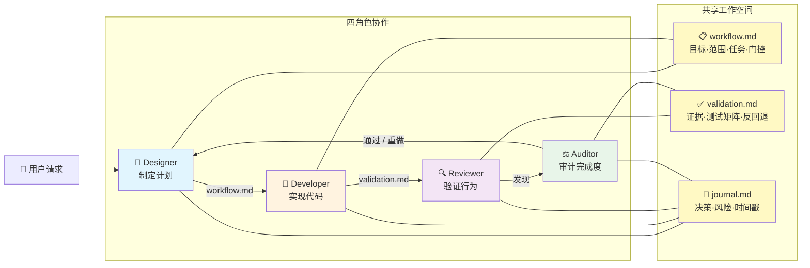
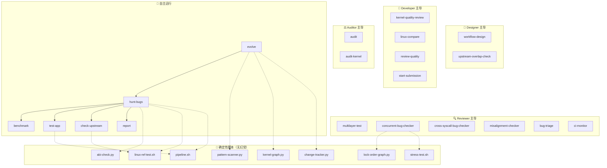
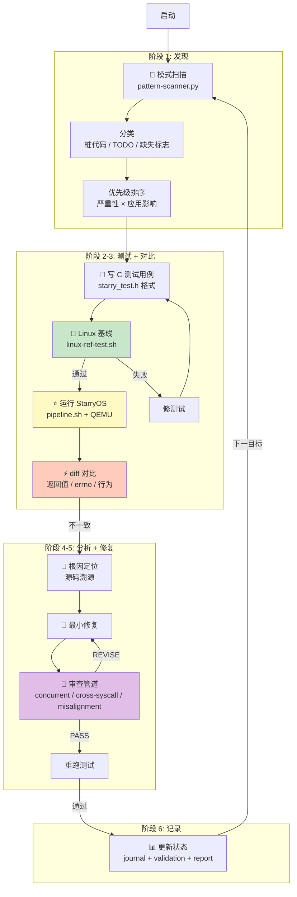

# 实验1: AI 驱动的内核开发框架 (StarryOSHarness)

王鹏杰

> 本实验的核心结论：**在成熟内核上做 AI 辅助开发，决定代码质量的不是模型本身有多强，而是围绕模型构建的工程护栏有多严。** 把一次次被 reviewer 打回的经验蒸馏成结构化的审查技能后，一个弱很多的开源模型（DeepSeek-V4）在框架下重做同一个并发任务，提交前就把当初裸用 Claude Opus 时反复返工的 bug 收敛掉了。

---

## 1.1 动机

内核开发有三个核心痛点：

**测试反馈周期长。** 内核改完要在 QEMU 里启动 StarryOS 再跑测试，单次迭代（build + rootfs + qemu + test）需要数分钟。在"发现 → 修复 → 验证"的循环里，大量时间耗在等待编译和启动上。

**Linux 对照成本高。** 判断 StarryOS 的某个行为是否正确，往往需要在真实 Linux 上编译运行相同的测试程序、查 man page 确认预期，有时还要读 Linux 源码确认实现细节。错一个 errno、一个唤醒时机，行为就和标准分叉。

**重复性工作多，而且最贵的反馈来得最晚。** 每个 bug 的修复流程高度相似（写测试 → 跑 Linux 对照 → 改内核 → 跑 StarryOS 验证 → 写报告），但真正昂贵的反馈——reviewer 指出的并发竞态、跨 syscall 状态不一致、和 Linux 语义不对齐——总是在**人工 review 阶段**才暴露，此时返工成本最高。

本实验的目标，就是把这些晚到的、昂贵的反馈**前移**：用一套四角色流水线和一组从真实 review 中蒸馏出来的审查技能，让 AI 代理在提交给人类之前，先在严格的工程护栏下自我证伪。

---

## 1.2 架构：四角色流水线

框架基于 Claude Code 的 Skills / Agents 插件机制，把内核开发拆成四个相互制衡的角色。角色之间**只通过共享的工作区文档**（`workflow.md` / `validation.md` / `journal.md`）通信，这些文档是跨角色、跨会话的单一事实来源：

四个角色的职责与主用技能：

| 角色 | 职责 | 主用技能 |
|------|------|----------|
| **Designer**（设计者） | 接受任务，阅读代码库，确认上游/本地是否已有重叠工作，产出可执行工作流并维护 `workflow.md` | `workflow-design`、`upstream-overlap-check` |
| **Developer**（开发者） | 执行已批准的工作流，保持改动 scope 可控，在 `validation.md` 记录实现证据 | `kernel-quality-review`、`linux-compare` |
| **Reviewer**（审查者） | **本地测试、主动找 bug、核对 Linux/POSIX/Unix 对齐**——使命是证伪而不是放行 | `multilayer-test`、`concurrent-bug-checker`、`cross-syscall-bug-checker`、`misalignment-checker`、`linux-compare`、`bug-triage`、`ci-monitor` |
| **Auditor**（审计者） | 独立于实现者，审计 workflow 与 PR 是否真正实现了最初意图、验证是否充分、有没有"看起来过了"的伪装 | `audit`、`kernel-quality-review`、`bug-triage`、`upstream-overlap-check` |

关键设计在于 **Reviewer 与 Auditor 独立于 Developer**：找 bug 的角色和写代码的角色由不同的 system prompt 驱动，目标函数相反——一个想让改动通过，一个想让改动失败。这正是把人类 reviewer 的对抗性反馈固化进流水线的方式。

整套框架共 **20 个技能 + 16 个确定性脚本**：技能按角色分工，脚本提供"无幻觉"的确定性能力（锁顺序图、危险模式扫描、Linux 对照执行、并发压测等），由技能在需要时调用：

---

## 1.3 核心工作流

以 `hunt-bugs` 主循环为骨架，一次完整迭代分为发现 → 测试 → 对照 → 分析修复 → 记录五个阶段，每个阶段都有明确产物和准入门槛；其中"审查管道"内部带 `REVISE` 回环，不通过就打回重做：

其中**审查（阶段 4-5 的 REVIEW 节点）是框架价值最集中的一步**。针对改动，Reviewer **并行**调用三个证伪技能：

- `concurrent-bug-checker`：识别共享可变状态的每条读/写/释放/发布路径，检查 allocation / publication / blocking / wakeup / close / fork / exec / exit / timeout / 错误回滚处的交错，找缺失的 happens-before、锁序环、持锁睡眠、双重 unlock、UAF、丢失唤醒、清理竞态。
- `cross-syscall-bug-checker`：列出改动的 syscall 与所有共享其状态的邻居 syscall（fd 表、open file description、inode 元数据、信号状态、内存映射……），构造"A 改变 B 应观察到的结果"的场景，**成功路径和失败路径都查**——大量跨 syscall bug 来自部分状态更新。
- `misalignment-checker`：把行为逐项对照 Linux/POSIX/Unix——返回值、errno、阻塞语义、flag 组合、资源生命周期、边界条件；特别警惕"fallback 让成功看起来是真的，却绕过了应有的行为"。

随后 Auditor 独立复核：意图是否真的实现、验证是否充分、有没有伪装的 stub 或被弱化的断言；给出 PASS / FAIL 裁决，**FAIL 意味着打回 Developer 重做，直到所有维度通过**。

---

## 1.4 三道工程护栏

**护栏一：结构化输出强制。** 所有审查/审计技能按固定 schema 把结论写进 `validation.md`（期望行为 vs 观察行为、证据、严重级别、是确认 bug 还是疑似风险）。流水线每一步的输出都能被下一步无歧义消费，避免"我看了一遍感觉没问题"这种不可验证的结论。

**护栏二：状态记忆，单一事实来源。** `journal.md`（决策/风险/blocker，最新在前）与 `validation.md`（证据矩阵）构成跨角色、跨会话的唯一事实来源。任何一个缺陷从发现到修复到回归都有可追溯的条目，防止重复修复，也能随时生成进度与分类报告。

**护栏三：审查者否决权（anti-fallback）。** Reviewer 与 Auditor 的使命被显式定义为"找问题，不是批准"。审查维度包括：修复后行为是否**精确**匹配 Linux、是否存在 TOCTOU 窗口或 UAF 风险、锁获取顺序是否全路径一致、错误路径上是否和成功路径用同一套清理纪律。审查失败 → 强制重做。已知但暂不修的限制必须**显式记录**（而不是悄悄绕过），例如下文第二轮中 `BUG-LEAK`、`BUG-CLOEXEC-TOCTOU` 被诚实地标注为已知限制并说明窗口大小。

---

## 1.5 对照实验：强模型裸跑 vs 弱模型 + 强护栏

这是本实验最核心的发现，也是构建整套框架的直接动因。**同一类并发任务，做了两轮。**

### 第一轮：Claude Opus 裸写，被 reviewer 反复打回

最初用 Claude Opus（当时的 SOTA 闭源模型）直接实现 EXP2 的两个任务——多线程 execve（[#273](https://github.com/rcore-os/tgoskits/pull/273)）和 advisory 文件锁（[#472](https://github.com/rcore-os/tgoskits/pull/472)）。代码能编译、happy path 能跑通，但提交后被 reviewer（周睿老师）指出了**大量**问题，反复返工十余次。把这些问题归类，高度集中在三个方向：

| 方向 | #273 多线程 execve 暴露的问题 | #472 文件锁暴露的问题 |
|------|------------------------------|----------------------|
| **并发 bug** | `try_lock` 并发语义不够细粒度；CLOEXEC 快照时机错误导致迟到的 `F_SETFD`/`O_CLOEXEC` 丢失 | 子进程退出时失败路径回滚不一致 |
| **跨 syscall 交互** | vfork 的睡眠要能被 zap（SIGKILL）打断；execve 与 clone/exit 的状态交错 | OFD 锁随 close/exit 的自动释放、与 fcntl/flock 的相互作用 |
| **与 Linux/POSIX 不对齐** | `execve(path, NULL, NULL)` 行为、信号重置语义 | 负的 `l_len`、唤醒与返回值模式与 POSIX 不符 |

关键观察：**这些 bug 全部是在人工 review 阶段才暴露的**，而它们恰恰是内核里最难靠"跑一遍测试"发现的一类——偶发竞态、只在特定 syscall 交错下出现、或语义上微妙地偏离标准。返工成本极高。

### 复盘：把 review 反馈蒸馏成可复用的审查技能

我把这十余轮 review 的反馈做了系统总结，发现它们几乎可以无损映射到三类"检查清单"，于是把它们固化成三个独立的 Reviewer 技能：

- **`concurrent-bug-checker`** ← 来自所有"竞态/锁/唤醒/清理"类反馈
- **`cross-syscall-bug-checker`** ← 来自所有"一个 syscall 改了另一个 syscall 该看到的状态"类反馈
- **`misalignment-checker`** ← 来自所有"和 Linux/POSIX/Unix 不一致"类反馈

这三个技能不是泛泛的"请仔细检查"，而是把人类 reviewer 的对抗性直觉沉淀成了可机械执行的工作流和检查项（见 §1.3）。

### 第二轮：弱模型在框架下重做，提交前自我收敛

随后换用能力弱很多的开源模型（**GLM-5.1 与 DeepSeek-V4**）在 harness 框架下**重做多线程 execve**（情境：为 execve 提供多线程支持；工作区 `test_harness/support_multi-threaded_execve`）。这一次，Reviewer 和 Auditor 在**提交给人类之前**就用上述技能反复证伪。从 `journal.md` 的记录可以看到，框架内部自己捕获并修掉了和第一轮**同一类**的 bug：

| 内部捕获的缺陷 | 类别 | 命中的技能 |
|----------------|------|-----------|
| **C3**：clone 检查在 `add_thread()` 之前，新线程能逃过 execve 的标记循环（TOCTOU） | 并发 + 跨 syscall | concurrent / cross-syscall |
| **BUG-MEMCORRUPT**：被强制移除的线程其 `clear_child_tid`/`robust_list_head`/`rseq` 残留，会向新地址空间写脏 VA | 跨 syscall（exec×futex×clone） | cross-syscall |
| **BUG-SIGSTATE**：Phase 2 与 Phase 3 之间未检查 pending SIGKILL，违反 Linux "killable" 语义 | 与 Linux 不对齐 | misalignment |
| **U1**：迟醒的强制移除线程会覆盖 `tg.exit_code` | 并发（竞态） | concurrent |
| **BUG-LEAK / BUG-CLOEXEC-TOCTOU** | 已知限制，**诚实标注**而非绕过 | anti-fallback |

收敛过程是可量化的——**Budget：Reviewer 审查 4 轮、Auditor 审查 2 轮**：Auditor 首轮裁决为 **FAIL**（4 个 critical 必须先修），打回修复后复审才 PASS；并行子代理（并发审计 + 内核质量审查）独立交叉验证；7 条关键路径（happy path、CAS loser、failed exec、SIGKILL abort、CLONE_THREAD rejection、TOCTOU clone race、force-removal）逐条 source-level 追踪确认正确。最终自己解决了"可失败阶段破坏线程组、execve 并发阻塞语义更细粒度、CLOEXEC 竞态、vfork 阻塞、`execve(path, NULL, NULL)` 对齐 Linux、多线程 execve 回归测试充分"等问题；仍诚实地标注一个未尽项：execve 后没有 `do_thread`，因此不恒定满足 `gettid() == getpid()`。

### 结论

**弱模型 + 强护栏 > 强模型裸跑。** 第一轮里强模型的 bug 由昂贵的人工 review 在事后发现、反复返工；第二轮里弱模型的同类 bug 由框架在事前证伪、提交前收敛。决定性的差异不是模型参数量，而是有没有把"过往 review 经验"结构化成对抗性的、可机械执行的审查护栏。这也回答了"AI 工程"的本质问题：**真正稀缺的不是更强的模型，而是把领域反馈固化成流程的能力。**

---

## 1.6 与现有工具的对比

**相比传统开发框架**，本框架不替代 build/test/CI，而是在它们之前插入一层"对抗性自审查"。传统 CI 只能发现"编译失败 / 测试断言失败"这类显式错误，对偶发竞态、跨 syscall 状态不一致、语义级偏离基本无能为力——而这些恰恰是成熟内核上最贵的 bug。框架用 `linux-compare` 把"正确性"锚定到真实 Linux 行为，用三个 bug-checker 把人类 reviewer 的对抗性直觉前移，用 Auditor 的否决权防止"看起来过了"。

**相比裸用单个 AI 代理**，本框架的增量在于**角色分离 + 结构化状态 + 否决权**。单个代理既写代码又自评，目标函数一致，倾向于说服自己"没问题"；本框架让找 bug 和写代码由目标相反的角色承担，并强制把每条结论落到可验证的文档里。第二轮实验证明：正是这套结构让弱模型也能产出经得起 review 的并发代码。

**局限**：

- 框架擅长**找已知模式的 bug**（竞态、跨 syscall、语义不对齐），但对全新架构设计、需要深度权衡的创造性工作帮助有限——它把"在约束中演进"做得很好，却不负责"重新设计"。
- 审查质量仍受底层模型能力下限约束：弱模型在**强护栏**下能做好**已被结构化的**任务，但护栏的覆盖面来自人类过往经验的蒸馏，存在盲区——没被 review 过、没被写进 checklist 的 bug 类别，框架同样会漏。
- 多角色 + 多轮审查 + 子代理交叉验证带来显著的 token 与时间开销（单次深度审计的两个子代理报告即达 ~3.5 万 token 量级），适合高风险、难复现的内核改动，对琐碎改动则偏重。
- 护栏的有效性依赖人去持续维护 `journal.md` / `validation.md` 的纪律；一旦状态记录退化，单一事实来源的价值随之衰减。
