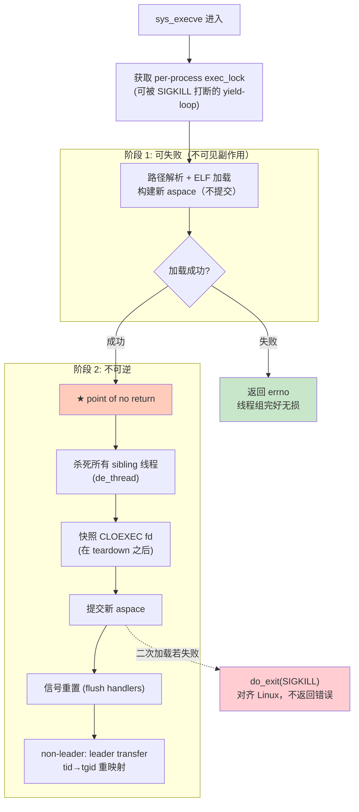

# 实验2: 内核功能支持（多线程 execve 与文件锁）

王鹏杰

> 本实验在 StarryOS 上补齐两个被大量真实 Linux 软件依赖、却长期是"假成功"占位实现的内核能力：**多线程进程的 `execve`**（[#273](https://github.com/rcore-os/tgoskits/pull/273)）和 **advisory 文件锁**（[#472](https://github.com/rcore-os/tgoskits/pull/472)）。两者都不是"加个 syscall"那么简单——真正的难点在于并发正确性、跨 syscall 状态一致性、以及和 Linux/POSIX 语义的逐位对齐。这也是 EXP1 三个 bug-checker 技能的直接来源（见 `report/exp1/report.md` §1.5）。

---

## 2.1 概述

EXP2 集中在**进程执行**与**文件锁**两个子系统，共 2 个 feature PR、约 +4900 行，均已合入主线。两者的共同点是：原实现都用"直接返回成功/`EWOULDBLOCK`"绕过了真正的语义，导致依赖它们的软件行为不可预测；而正确实现都高度涉及并发与 POSIX 边界条件，经历了多轮 reviewer（周睿老师）打回。

| 子系统 | PR | 原状态 | 影响的软件 | 暴露的缺陷类别 |
|--------|-----|--------|-----------|---------------|
| 进程 / exec | [#273](https://github.com/rcore-os/tgoskits/pull/273) | 多线程进程 `execve` 直接返回 `EWOULDBLOCK` | `rustc`/LLVM、`cargo`、任何从线程池 `std::process::Command` 的程序 | 并发竞态、跨 syscall 交互、与 Linux 语义不对齐 |
| 文件锁 | [#472](https://github.com/rcore-os/tgoskits/pull/472) | `fcntl` 所有 lock 命令与 `flock` 均返回 `Ok(0)` 不真正加锁 | dpkg、sqlite、postfix、nginx pid file 等并发协调软件 | Linux/POSIX 语义对齐、阻塞唤醒、失败路径回滚 |

---

## 2.2 PR 汇总

| PR # | 创建 | 合入 | 标题 | 规模 | 类型 |
|------|------|------|------|------|------|
| [#273](https://github.com/rcore-os/tgoskits/pull/273) | 04-19 | 05-20 | feat(starry): support multi-threaded execve | +1732 / -85，21 文件 | Feature |
| [#472](https://github.com/rcore-os/tgoskits/pull/472) | 05-09 | 05-12 | feat(starry): implement advisory file locks (fcntl POSIX/OFD, flock) | +3201 / -18，41 文件 | Feature |

两个 PR 都不是一次过——#273 从创建到合入跨越一个月、经历 5 次 rebase 与至少 3 轮针对竞态的修复；#472 经历周睿老师 **6 轮 `CHANGES_REQUESTED`** 才最终 `APPROVED`。下文逐一展开。

---

## 2.3 重点 PR 分析

### 2.3.1 多线程 execve [#273]

**问题。** 此前 `sys_execve` 在调用进程拥有多个线程时直接返回 `EWOULDBLOCK`。任何多线程父进程调用 `execve` 都会失败——这几乎覆盖了所有现代工具链：`rustc`/LLVM、`cargo` 的进程 spawn、以及任何从线程池驱动 `std::process::Command` 的程序。

**实现：两阶段提交（point-of-no-return）。** 核心难点是 `execve` 语义上要"用新映像替换整个进程、杀掉所有 sibling 线程"，但这个动作**不可逆**——一旦杀了 sibling，就不能再失败回退。因此实现严格分成"可失败阶段"和"不可逆阶段"，commit 点之前的任何错误都必须能干净返回：

**关键设计决策。**

1. **并发 execve 序列化**：通过 per-process `exec_lock` 序列化。锁等待是 yield-loop + `exit_request` 探测，匹配 Linux 的 "killable but not signal-interruptible" 语义——能被 SIGKILL 打断，但不会被普通信号中断。
2. **CLOEXEC 快照时机**：在 sibling teardown **之后**才快照 CLOEXEC fd，确保迟到的 `fcntl(F_SETFD)` / `open(O_CLOEXEC)` 不会丢失。
3. **Non-leader execve**：通过 `de_thread` leader transfer 实现。调用者将其 `Thread::tid` 重命名为 TGID，重新映射全局 task table、signal child list 和 `proc.tg.threads`，使 `gettid() == getpid()` 在新映像中成立。
4. **信号重置**：匹配 Linux 的 `flush_signal_handlers` + `do_execveat_common` 语义——自定义 handler 恢复为 `SIG_DFL`，显式 `SIG_IGN` 的信号保留。

**评审迭代（review 记录）。** 周睿老师（@ZR233）首轮 `CHANGES_REQUESTED` 即指出多个核心问题，配合 octopus-review 机器人的静态发现，可归纳为三类——这恰好是 EXP1 三个 bug-checker 的雏形：

| 类别 | reviewer 指出的问题 | 处置 |
|------|--------------------|------|
| **scope / 工程规范** | PR 顺带把 workspace `default-members` 改成只剩 `starryos`，会静默改变根目录 `cargo build/test/clippy` 的默认对象，影响面过大 | 移出本 PR，改局部修复 |
| **并发 bug** | ① `exec_lock` 用 `try_lock`，并发 execve 返回 `EINTR` 而非阻塞；② 每次 execve 都做两遍完整 ELF 加载（probe + real），单线程常见路径也变贵；③ probe 地址空间未显式 drop 就进入 teardown | 阻塞语义改细粒度；探测路径裁剪；显式 drop |
| **跨 syscall / 失败路径** | ① 在所有可失败的 ELF 加载/路径解析**之前**就向 sibling 发 SIGKILL——若后续加载失败则线程组已被破坏；② 不可逆 teardown 之后二次 `load_user_app` 若失败，`?` 把错误返回给调用者，此时进程已处于不一致状态——Linux 的做法是 `do_exit` 杀掉进程 | 把破坏线程组的动作移到 commit 点之后；二次加载失败改为强制 `do_exit(SIGKILL)` |
| **测试缺失** | 缺少多线程 exec 成功/失败回归测试 | 新增 `test-mt-execve`，覆盖 happy path、失败保留线程组、非 leader execve、NULL argv/envp、pending-signal-survives-execve 等阶段 |

这些反馈对应到 git 上的修复提交链：`fix(starry/execve): address 4 multi-thread execve race issues` → `test: regression phases for ZR233-flagged exec races` → `fix: align robust-futex owner TID + defer CLOEXEC close past fd-table lock` → `fix(signal): preserve pending signals across execve` → `fix: execve accepts NULL argv/envp and fully resets user context`。期间为对齐 `rcore/dev` 做了 5 次 rebase（每次保留备份分支），04-19 创建、05-20 合入。

**遗留问题。** execve 后没有重新 `do_thread`，因此不**恒定**满足 `gettid() == getpid()`（仅在 leader transfer 路径成立）——作为已知限制诚实标注，未来需补。

---

### 2.3.2 advisory 文件锁 [#472]

**问题。** `sys_fcntl` 的所有 advisory lock 命令（`F_SETLK` / `F_SETLKW` / `F_GETLK` 及对应 `F_OFD_*`）以及 `sys_flock` **全部返回 `Ok(0)` 而不实际加锁**。依赖文件锁做并发协调的软件（dpkg、sqlite、postfix、nginx pid file 等）行为完全不可预测——它们以为拿到了独占锁，实际谁都能进。

**实现。** 新增 `kernel/src/syscall/fs/lock.rs` 作为完整的 advisory lock 子系统，维护两类互不影响的锁表，均以 `(device, inode)` 为 key：

- `FCNTL_LOCKS`：POSIX 记录锁（owner = pid）与 OFD 锁（owner = open file description，用 `Arc::as_ptr` 作身份指纹、持 `Weak` 用于 close 检测）。
- `FLOCK_LOCKS`：`flock(2)` 锁（owner 同 OFD）。

范围语义采用 half-open `[start, end)`，`l_len == 0` 表示"到文件尾"（存为 `i64::MAX`）；同 owner 设新锁前先移除/分裂旧区间再插入；OFD 锁随 `Weak::strong_count() == 0` 自动剪枝。

**评审迭代（review 记录）——这是本实验最硬核的部分。** 周睿老师对 advisory lock 的 Linux/POSIX 语义把关极严，连续 **6 轮 `CHANGES_REQUESTED`**，几乎每一轮都在本机真实 Linux 上做了 `open()/fcntl()/flock()` 探测来锚定预期行为，直到第 7 轮（commit `d9504f35`）才 `APPROVED`。把这些 review 逐条整理成"问题 → Linux/POSIX 预期 → 修复 + 回归用例"：

| reviewer 指出的问题 | Linux/POSIX 预期 | 修复 + 回归用例 |
|--------------------|-----------------|----------------|
| 漏导入 `F_GETLK` 常量，Rust 把它当**新模式变量**，导致该分支匹配**所有** `fcntl` 命令（`F_DUPFD` 等被当 `struct flock` 指针读） | 非锁命令走原处理路径 | 补常量导入；clippy 不可达分支消除 |
| POSIX 锁 owner=pid，但**进程退出/`close`/CLOEXEC 都不释放** | 进程退出、关闭指向同文件的任意 fd 时释放该进程在该文件上的所有 POSIX 锁 | 在 `close_file_like` / `close_range` / exec CLOEXEC 路径按 pid+inode 清理；用例 `bug-fcntl-posix-exit-release` / `bug-fcntl-posix-close-release` |
| `F_SETLKW` / `F_OFD_SETLKW` 只返回 `EAGAIN`，**未实现阻塞等待** | 冲突锁释放前阻塞等待 | 加等待队列/唤醒；用例 `bug-fcntl-setlkw-blocks` |
| 部分解锁不唤醒：用 `entries.len() != before` 判断会漏掉"A 持 `[0,100)`、B 等 `[0,50)`、A 只解 `[0,50)`"（长度不变） | 冲突范围释放后重新检查、唤醒等待者 | `clear_owner_overlap()` 改返回 `bool`，区间被拆分即唤醒；用例 `bug-fcntl-partial-wake` |
| `flock` 无 `LOCK_NB` 的冲突被当非阻塞处理 | `LOCK_SH`/`LOCK_EX` 无 `LOCK_NB` 时阻塞，仅 `LOCK_NB` 返回 `EWOULDBLOCK` | `FLOCK_WAITERS` 等待队列；用例 `bug-flock-blocks`（阻塞唤醒 / `LOCK_NB` 短路 / 信号 EINTR 三阶段） |
| `flock` 升级失败丢锁：先删旧锁再检查冲突，`LOCK_SH→LOCK_EX\|LOCK_NB` 失败后旧 `LOCK_SH` 丢失 | Linux 转换失败语义（先移除再尝试，非阻塞失败不恢复）——reviewer 还指出**原测试把预期写反了** | 按 Linux 语义调整转换流程并修正测试；用例 `bug-flock-failed-upgrade` |
| 负 `l_len` 被直接拒绝 | Linux 支持反向区间（按 `l_start`/`l_len` 归一化） | 计算反向锁区间；用例 `bug-fcntl-len-negative` |
| `l_whence` 只接受 `SEEK_SET` | 支持 `SEEK_CUR`（按 fd 游标）/ `SEEK_END`（按文件大小）；目录 fd 的 CUR/END 返回 `EINVAL` | `resolve_l_start()` 按 whence 归一化（新增 `File::position()`）；用例 `bug-fcntl-whence` |
| `F_OFD_*` 未校验 `l_pid` | POSIX.1-2024 要求 OFD 命令 `l_pid` 必须为 0，否则 `EINVAL` | OFD 分支统一校验 `l_pid == 0`；用例 `bug-fcntl-ofd-pid-einval` |
| 安装锁前不校验 fd 打开模式 | `F_RDLCK` 需 fd 可读、`F_WRLCK` 需 fd 可写，否则 `EBADF` | 按 `open_flags()` 校验；用例 `bug-fcntl-fd-mode-ebadf` |
| 目录 fd 不能加锁（`inode_key()` 默认 None） | Linux 允许对目录 fd 加 advisory lock（`O_DIRECTORY` + `F_SETLK`/`flock(LOCK_SH)`） | `Directory` 实现 `inode_key()`；用例 `bug-advisory-lock-dir` |
| `O_PATH` fd 被当普通可锁 fd | `open(path, O_PATH)` 后 `fcntl`/`flock` 都应返回 `EBADF` | 在 advisory-lock 入口排除 `O_PATH` |

对应 git 修复提交链：`fix: fcntl dispatch, POSIX exit release, flock upgrade rollback` → `fix: F_SETLKW blocking + reverse-range l_len + close-time wake` → `fix(locks): four advisory-lock semantics fixes from review` → `test(bugfix): cover advisory-lock semantics from review`。最终落地 **14 个 C 回归用例**，在 riscv64 / aarch64 / x86_64 / loongarch64 四个架构的 `qemu-*.toml` 全部注册。批准时 reviewer 确认锁顺序一致（`WaitQueue → FCNTL_LOCKS/FLOCK_LOCKS`，唤醒均在锁外发出）。

**遗留问题。** 已知限制在 review 过程中被逐一消化（`O_PATH`、目录锁、whence 等都补齐），合入时无阻塞性遗留。

---

## 2.4 共性结论

两个 PR 的 review 反馈高度收敛到**四类**典型缺陷——它们正是 EXP1 三个 bug-checker 技能的经验来源：

| 缺陷类别 | #273 表现 | #472 表现 | 对应 EXP1 技能 |
|----------|-----------|-----------|---------------|
| **并发 / 阻塞唤醒** | `try_lock` 返回 EINTR、probe 未 drop、sibling teardown 竞态 | `F_SETLKW` 未阻塞、部分解锁不唤醒、flock 未阻塞 | `concurrent-bug-checker` |
| **跨 syscall 状态一致性** | 二次加载失败后进程状态不一致、robust-futex TID、CLOEXEC 与 fd-table 锁 | POSIX 锁未随 close/exit/exec 释放 | `cross-syscall-bug-checker` |
| **与 Linux/POSIX 不对齐** | NULL argv/envp、信号重置、非 leader 身份 | 负 l_len、whence、OFD l_pid、fd 模式、O_PATH、目录锁 | `misalignment-checker` |
| **失败路径回滚** | 失败时必须保留线程组、不可逆点改 `do_exit` | flock 升级失败保留原锁、错误分发 | （并入上三类的失败路径检查） |

**核心体会：** 在成熟内核上做功能补全，"能编译、happy path 能跑"只是起点。真正决定能否合入的，是**偶发竞态、跨 syscall 的状态交错、以及和标准的逐位对齐**——而这三者恰恰是最难靠跑一遍测试发现、最依赖 reviewer 经验的部分。#273 和 #472 被反复打回的十余轮反馈，被我系统总结后蒸馏成了 EXP1 的三个证伪技能，使得后续即便用更弱的模型，也能在提交前把同类 bug 收敛掉（详见 `report/exp1/report.md`）。

*附：两个 PR 的完整 review 线索见 GitHub [#273](https://github.com/rcore-os/tgoskits/pull/273) / [#472](https://github.com/rcore-os/tgoskits/pull/472)。*
