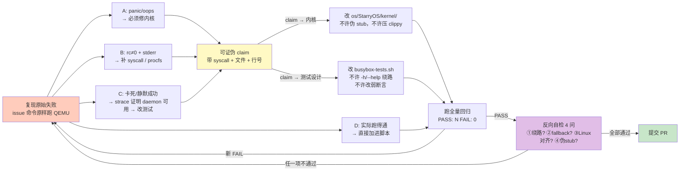

# 实验3: BusyBox 应用兼容性支持

王鹏杰

> 本实验以 BusyBox 作为 Linux 应用兼容性的探针，目标是让 StarryOS 通过 issue [linux-compatible-testsuit#13](https://github.com/rcore-os/linux-compatible-testsuit/issues/13) 列出的一批 applet 测试。但真正的难点不是"让测试变绿"——而是**不靠造假让它变绿**。BusyBox 的 multi-call 二进制里塞了大量 daemon、文件 round-trip、ioctl 等"硬路径"，最省事的过法是用 `-h` 触发 usage banner、用 `[ -n "$_t" ]` 这种弱断言糊弄过去，但那等于把内核的 bug 藏起来。为此我专门设计了一套带**反向自检（anti-fallback）**的工作流，强制每个 applet 先复现真实失败、再决定"改内核还是改测试"。

---

## 3.1 概述

BusyBox 工作横跨约 5 周（4 月下旬至 5 月下旬），最终使测试套件达到 **320 PASS / 0 FAIL**，覆盖 riscv64 / aarch64 / x86_64 / loongarch64 四个架构。它的价值不在数量，而在**测试质量**：把一批"smoke 级"弱测试升级成能反向证伪内核回归的语义级测试，并在这个过程中挖出并修复了真实的内核 bug。

这条主线最能说明问题的，是 issue #13 里被点名的几个 applet 早期处置方式的演变：

| 阶段 | 做法 | 问题 |
|------|------|------|
| 早期（捷径） | `acpid -h` / `add-shell --help` 触发 usage banner，断言 `[ -n "$_t" ]` | 命令的真实路径（daemonize、`rename` /etc/shells、扫描循环）从未被执行，内核就算坏了测试也不会挂 |
| 新流程（本实验） | 复现 issue 原始命令 → 看 StarryOS 真实行为 → 写可证伪 claim → 决定改内核/改测试 → 反向自检四问 | 测试要么覆盖真实硬路径，要么明示"为什么硬路径在 StarryOS 上暂不可用"并登记欠账 |

下文先讲为这个任务设计的工作流（§3.2），再用 4 个代表性 PR 展示它在实战中如何区分"该改测试 / 该改内核 / 诚实记限制"（§3.3）。

---

## 3.2 为这个任务设计的工作流

整套流程的一句话纲领是：**"不允许先把测试改通过、再回头编故事。"** 必须先复现 issue 给的原始命令、看清 StarryOS 当前的真实行为，写下一句**可证伪**的失败原因 claim，再据此决定路径。流程图如下（每个 applet 独立分支、独立 PR、一次只改一个）：

**关键约束（来自 workflow 的硬性规定）：**

- **复现是强制步骤**（§5.2）：把 issue 命令**原样**搬进脚本跑一次，把现象归到 A/B/C/D 四类并留下证据（容器 stdout/rc、strace 对照、panic backtrace）。没攒够证据不许进入下一步。
- **claim 必须可证伪**（§5.3）：带具体 syscall / 文件 / 行号，能被新观察推翻——不能是"感觉/应该/可能"。
- **改测试只许加强、不许削弱**（§5.4）：不允许把硬路径（daemonize、`rename`、扫描循环、ioctl）替换成只触发 usage banner 的 `-h`/`--help`；不允许把断言改成 `[ -n "$_t" ]` 这类"永远会过"的弱条件。加强的方向是"更难蒙过"，不是"更容易过"。
- **提 PR 前的反向自检四问**（§5.6，对应 PPT 的审计图）——结果原样写进 PR 正文：
  1. 这次"通过"是不是**绕开了真正的代码路径**？（`-h` 代替 daemon、`||true` 吞掉非零 rc）
  2. BusyBox 是否在 StarryOS 上偷偷 **fallback** 到无害分支？（某 syscall 返 ENOSYS 后静默走 fallback，让命令看起来 rc=0）
  3. 行为是否与 **Linux/POSIX 对齐**？（同一段 stdout、同一个 rc，在标准 Alpine 上一致）
  4. 新增内核代码是否引入**伪 stub / 未测旁路**？（必须能写出一条今天就触发新代码的命令）
- **test-only PR 要登记欠账**（§5.9）：如果走的是"改测试"路径，必须写明哪条 daemon/syscall 路径没被覆盖，不许用"反正 issue 没要求"当关闭理由。

这套流程的直接成果，是把早期 `acpid`(#722)、`add_shell`(#723)、`crond` 三个"触发任意前台输出就算过"的捷径 PR 重做或淘汰（参见 [#752](https://github.com/rcore-os/tgoskits/pull/752) `remove non-semantic BusyBox checks`）。

---

## 3.3 重点 PR 分析

四个代表性 PR 恰好覆盖了工作流的全部分支结果——从"诚实记限制"到"加强测试"到"挖出真内核 bug"：

| PR | applet | issue 验证 | 走的路径 | 规模 |
|----|--------|-----------|----------|------|
| [#722](https://github.com/rcore-os/tgoskits/pull/722) | acpid | `[ -n "$_t" ]` | C → 改测试（硬路径不可用，**诚实记限制**） | +15 |
| [#751](https://github.com/rcore-os/tgoskits/pull/751) | add-shell | `[ -n "$_t" ]` | D/C → 改测试（弱 banner **升级**为真实 round-trip） | +33 |
| [#741](https://github.com/rcore-os/tgoskits/pull/741) | crond | `grep -qF crond_ok` | C → 改测试（真实 **daemonize** 端到端） | +64 |
| [#750](https://github.com/rcore-os/tgoskits/pull/750) | crontab | 装入并读回 | B → **改内核**（挖出 ax-fs-ng 真 bug） | +38 |

### 3.3.1 busybox_acpid [#722] —— 诚实记限制

**问题。** busybox `acpid` 默认调用 `bb_daemonize_or_rexec`，在 fork 之前就关闭 stdout/stderr，父进程返回 0 且无输出——照搬 issue 的 `[ -n "$_t" ]` 永远拿不到非空输出。更根本的是，StarryOS 当前**不暴露** `/dev/input/event*` 或 `/proc/acpi/event`，acpid 无法真正进入事件循环。

**处置。** 这是工作流里"硬路径确实不可用"的情形：传入未知选项 `-h`，让 busybox 的 `getopt32` 走到 `bb_show_usage`，输出 "Usage: acpid ..." 后退出，从而确认 applet 表中确实内置了 acpid。这是 busybox 测试的标准技巧（脚本里 `whois`/`xzcat`/`zcip` 同模式）。**关键是诚实**：PR 明示了为什么不能用 issue 原始方式、以及内核限制所在，并按 §5.9 登记了"acpid 真实事件循环未覆盖"的欠账。reviewer 确认无回归、动机清晰，`APPROVED`。

### 3.3.2 busybox_add_shell [#751] —— 弱 banner 升级为真实 round-trip

**问题。** 早期版本（已关闭的 #723）用 `add-shell --help` 触发 banner 弱验证——典型的"绕过硬路径"。而 `add-shell <path>` 的真实语义是把 `<path>` 追加进 `/etc/shells`（busybox `loginutils/add-remove-shell.c`：`open(O_RDONLY)` 读 → `open(O_WRONLY|O_CREAT|O_TRUNC)` 写 `.tmp` → `rename(2)` 替换）。

**处置（升级测试）。** 重写为真实文件系统 round-trip：用 `$$` 生成唯一 probe 路径 `/tmp/bb_addshell_probe_$$`（避开 busybox 的 `dont_add` 早退分支），三条件 AND 断言——(a) rc=0；(b) `grep -qxF "$probe" /etc/shells` 精确命中新增行；(c) `/etc/shells.tmp` 不残留（已被 rename）；并先备份 `/etc/shells`、测后恢复保证幂等。reviewer 特别点出它的**反向证伪能力**：能检出 axfs-ng `O_TRUNC` 异常、`sys_renameat2` 同目录 rename 返非 0、rootfs 缺 `/etc/shells`、busybox 写完未 rename 等回归（基线 PASS 314→315）。`APPROVED`。

### 3.3.3 busybox_crond [#741] —— 真实 daemonize 端到端

**问题。** 早期让 crond 在前台跑（`-fc`）规避 daemon 复杂度；真实语义是 `daemon()`（fork → setsid → chdir → dup2）后进入 `while(1){ sleep_to_next_minute(); scan_crontabs(); }` 主循环。

**处置（端到端验证 daemon 行为）。** 测试覆盖三个关键 POSIX daemon 行为：① `crond -c <dir>` 父进程立即返回 rc=0（daemonize 成功）；② 通过 `ps | grep argv` 找到 detached daemon（注释解释了为何不能用 `pidof`——multi-call 二进制 argv[0] 是 "busybox"，与 Linux 一致）；③ `kill <pid>` 后 1 秒内进程消失、无僵尸（SIGTERM 干净退出）。这是 vfork/daemonize 能力（#377）的直接受益者。reviewer 评价"质量较高、不存在绕路问题"，但指出与 dev 上 #668/#665 有**合并冲突**，需 rebase——这也印证了 workflow §6 的风险提示。rebase 后合入。

### 3.3.4 busybox_crontab [#750] —— 挖出并修复真内核 bug

**问题（B 类 → 改内核）。** crontab 装入 crontab 文件时失败但返回 0 谎称成功。复现后定位到**真实内核 bug**：`ax-fs-ng` 的 `OpenOptions::is_valid()` 把 `O_TRUNC | O_APPEND` 当作冲突标志拒绝（旧三分支 match 里 `append=true` 时若 `truncate && !create_new` 即拒绝），而 busybox `miscutils/crontab.c` 正是用 `O_WRONLY|O_CREAT|O_TRUNC|O_APPEND` 这一组合。

**修复。** 把过度限制改成单条 if：仅 `truncate && !write && !append`（纯只读+truncate）拒绝，其余放行。reviewer 逐项核对了与 Linux/POSIX/Rust std 的对齐——Linux 上 `O_TRUNC` 在 open 时截断、`O_APPEND` 在每次 write 前 seek 末尾，作用时间点不同、互不冲突；POSIX 未禁止；Rust std `OpenOptions` 仅在 `!write && !append` 时拒绝 truncate，与新逻辑一致。改动是**纯放松**（新接受组合是旧的超集），不会击穿其他 applet。配套加了 crontab 回归（先添加、再 ls、最后删除的严格 round-trip）。`APPROVED` 合入。

---

## 3.4 共性结论

四个 PR 在工作流里走了三条不同路径，恰好构成一个完整的光谱：

| 路径 | 代表 PR | 判定依据 | 体现的纪律 |
|------|---------|----------|-----------|
| **诚实记限制** | #722 acpid | 硬路径依赖的 `/proc/acpi/event` StarryOS 暂不支持 | 允许 usage-banner，但必须明示限制 + 登记欠账（§5.9） |
| **加强测试** | #751 add-shell、#741 crond | 硬路径（rename / daemonize）在 StarryOS 上其实可用 | 弱 banner / 前台规避 → 真实 round-trip / 端到端 daemon（§5.4 只许加强） |
| **改内核** | #750 crontab | 复现暴露真实 syscall 缺陷（ax-fs-ng open flags） | 找根因、对齐 Linux/POSIX、纯放松、配回归（§5.4 改内核路径） |

**核心体会：弱测试不是"测试覆盖不足"，而是"主动把内核 bug 藏起来"。** 一个 `acpid -h` 跑出 usage banner 的"PASS"，和 acpid 真正进入事件循环的 PASS，对内核的要求天差地别——前者甚至能在内核完全坏掉时依然变绿。BusyBox 兼容性工作真正的产出，不是 320 这个数字，而是一套**强制区分"真过"与"假过"的工作流**：先复现、再 claim、按证据决定改内核还是改测试、提交前用反向自检四问把关。这套"审计先于实现"的纪律，与 EXP1 把 reviewer 经验蒸馏成 bug-checker、EXP2 在 review 中逐位对齐 Linux 语义，是同一种工程观的不同侧面。

*附：四个 PR 见 GitHub [#722](https://github.com/rcore-os/tgoskits/pull/722) / [#751](https://github.com/rcore-os/tgoskits/pull/751) / [#741](https://github.com/rcore-os/tgoskits/pull/741) / [#750](https://github.com/rcore-os/tgoskits/pull/750)；完整工作流见 `report/harness/workflow_example/busybox-fix-workflow.md`。*
