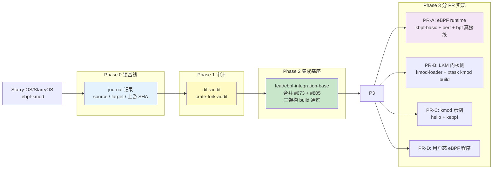
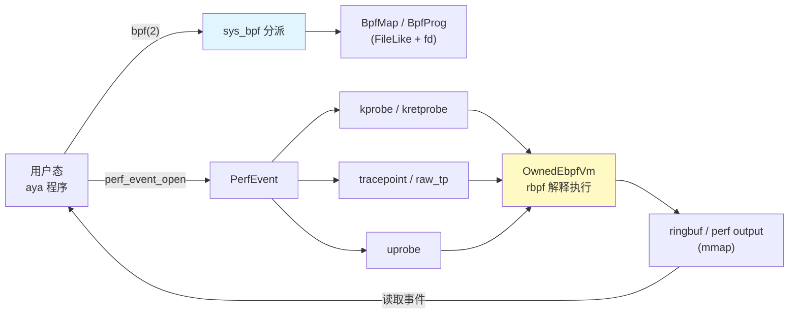

# 实验4: eBPF 与 LKM 内核扩展机制

王鹏杰

> 本实验把一套**内核可观测性与可扩展性基础设施**——eBPF 运行时与 LKM（Loadable Kernel Module，可加载内核模块）机制——从独立仓库 `Starry-OS/StarryOS:ebpf-kmod` 迁移并重构到 tgoskits 主线。两条线并行推进：**eBPF 线**让用户态程序能在内核里安全地挂探针、采事件；**LKM/kmod 线**让 `.ko` 模块能在运行时加载进内核并与内核子系统交互。由于 source 与 target 基线已分叉一年以上、还叠加了上游两个在做同一件事的开放 PR，这次迁移不是机械 cherry-pick，而是一次**审计驱动**的工程。

---

## 4.1 概述

迁移的源分支 `ebpf-kmod` 与 tgoskits `dev` 分叉超过一年，涉及 6+ 个 crate（`ksym` / `kprobe` / `ktracepoint` / `kbpf-basic` / `kmod-loader` / `rbpf`）和四个架构（x86_64 / riscv64 / aarch64 / loongarch64）的内核构建链改造，且上游已有 #673（tracepoint）、#805（kallsyms/kprobe/eBPF stub）两个开放 PR 在覆盖部分能力。因此第一步不是写代码，而是**锁基线、审差异、定 PR 边界、立验证门槛**。

| 线 | 目标 | 核心 PR / 工作 | 状态 |
|----|------|---------------|------|
| **eBPF 运行时** | 把 `bpf(2)` → map/prog → perf → kprobe/tracepoint → rbpf 执行的完整数据流接入 starry-kernel | [#850](https://github.com/rcore-os/tgoskits/pull/850) 运行时迁移、[#886](https://github.com/rcore-os/tgoskits/pull/886) 内核侧运行时（tracepoint/kprobe/perf/uprobe）、[#1132](https://github.com/rcore-os/tgoskits/pull/1132) 可运行 demo | #850/#886 已合入，#1132 推进中 |
| **LKM / kmod** | 运行时加载 `.ko`、解析符号、与内核子系统交互，并提供 `cargo xtask` 构建链 | [#851](https://github.com/rcore-os/tgoskits/pull/851) LKM loader + `cargo xtask starry kmod build`、`hello` / `kebpf` 可加载模块 | loader 已合入，模块持续推进 |

---

## 4.2 迁移工作流与代码审计

这次迁移最关键的产出之一，是一份专门的迁移工作流 `WORKFLOW_EBPF_LKM_MIGRATION.md`——因为"source 与 target 分叉一年、上游并行 PR、6+ crate、4 架构"决定了**任意一人独立机械搬运都会失控**，必须先把事实和边界用审计文件固定下来。整个流程按四个 Phase 推进：



**审计结论（决定"什么不迁"和"什么不许引入"）：**

- **已有能力不重复迁。** break/debug 异常（#244）、`/proc/pid/maps`（#306）、dynamic debug（#446）已并入 dev；tracepoint（#673）、kallsyms + kprobe + eBPF stub（#805）已在开放 PR 中覆盖。因此本次只补 perf 文件 + `kbpf-basic` 真实现、LKM loader、示例模块、用户态程序，而不是把旧仓 9900 行全量搬运。
- **禁止引入个人 fork。** `crate-fork-audit` 逐条核对了 source 的 5 条 `[patch.crates-io]`（指向 `Godones/{axcpu,arceos,page_table_multiarch}` fork），结论是**全都不需要**——tgoskits 已把这些 crate vendor 进仓并重命名为 `ax-*`，fork 在依赖图里完全没有触达点。任何迁移 PR 出现 `Godones/*` patch 直接驳回。
- **不复制旧构建系统。** 旧仓的 `Makefile` / `kmod.mk` / `kallsym.ld` 一律不搬，统一重写为 `cargo xtask` 子命令和 `build.rs` 逻辑，与 tgoskits 工具链一致。
- **锁 SHA、不无声跟随 force-push。** 每个 PR 在 body 第一行写明 stacked-on 的 dev / #673 / #805 的 SHA，review 期间按记录的 SHA rebase。

正是这套"审计先于实现"的纪律，让两条线可以并行施工、且每个 PR 都背同一套验证门槛（fmt / clippy / 四架构 build / sync-lint / qemu）。

---

## 4.3 eBPF 运行时

**迁移路径。** 完整数据流是：



**核心 PR。**

| PR | 内容 | 规模 |
|----|------|------|
| [#850](https://github.com/rcore-os/tgoskits/pull/850) | 运行时迁移：`ebpf/` 子模块（`sys_bpf` 真分派、`BpfMap`/`BpfProg` FileLike、`KernelAuxiliaryOps`）+ 全新 `perf/` 子模块（`PerfEvent` 按 `PerfTypeId` 分派 kprobe/software/tracepoint/uprobe、ringbuf、`OwnedEbpfVm`） | +1949 / -2054，26 文件 |
| [#886](https://github.com/rcore-os/tgoskits/pull/886) | 内核侧运行时收敛：tracepoint / kprobe / perf 接线，uprobe 端到端，perf ringbuf mmap 副作用治理 | +792 / -97，31 文件 |
| [#1132](https://github.com/rcore-os/tgoskits/pull/1132) | 可运行 demo：`apps/starry/ebpf/` 下 uprobe / kprobe / kretprobe / tracepoint 用户态程序 + 构建链 | +6696，130 文件 |

**迁移后修复补充的组件与机制。** 迁移只是把"数据流"接通；真正让事件能从内核带回用户态、让探针在正确的指令上触发，是 #886 与后续 follow-up 里**逐项补齐**的一串组件与机制。按"内核 → 用户态"的链路顺序：

1. **perf ringbuf 的 `mmap(perf_fd)` 通路（本次最关键的修复）。** 迁移基线里 `PerfEvent` 没有覆写 `device_mmap`，走默认实现返回 `Err(NoSuchDevice)`：用户态 `mmap(perf_fd, …)` 直接 ENODEV，`BpfPerfEventWrapper::write_event` 又因 `phys_addr` 恒为 `None` 而**静默丢弃所有 sample**，空 `Drop` 还会泄漏页。修复补齐了整条通路——`FileLike::device_mmap` → `PerfEventOps::device_mmap` → `BpfPerfEventWrapper::device_mmap` 分配 `1 + 2ⁿ` 个物理连续页、调 `kbpf_basic::BpfPerfEvent::do_mmap` 初始化 `perf_event_mmap_page` 头（`data_offset`/`data_size`/`data_head`/`data_tail`），并用一个 **retainer（`Arc<dyn Any>` 锚）把这组页挂到用户 VMA 上**：这样即便用户 `close(perf_fd)`，仍被用户地址空间映射的内存也不会被释放，`munmap`/退出时才真正回收（修掉泄漏）。这条通路是所有 aya/libbpf 风格 perf buffer / ringbuf 输出的前提，`sched_trace`（§4.4）正是它的端到端验证。
2. **调度可观测性：三个 `sched:*` tracepoint。** 迁移基线只有 `syscalls:sys_enter_openat` / `sys_mkdirat` 两个 tracepoint（覆盖率 <1%）。修复新增 `sched:sched_switch`、`sched:sched_process_fork`、`sched:sched_process_exit`。难点在 `sched_switch` 的触发点位于 `axtask::switch_to` 内，而 `axtask` 是 ArceOS 模块、**不能反向依赖 starry-kernel**；故经 `ax_task::SchedTracepoint` 这一 `crate_interface` late-bind trait 把 hook 暴露出来，starry-kernel 侧用 `#[impl_interface]` 实现、内部调 `ktracepoint::define_event_trace!` 生成的 `trace_sched_switch`。`process_fork`/`process_exit` 则就近定义在各自发生点（`clone.rs` / `task/ops.rs`）。
3. **uprobe 端到端。** 迁移基线 `perf_event_open(PERF_TYPE_UPROBE)` 直接返回 `Unsupported`。修复实现：从 `perf_event_attr` 取目标 ELF 路径 + 文件内 `offset` + `pid`，在目标进程地址空间里按 `Backend::file_info().path` 找到该 ELF 的 VMA、解析出 `vma.start() + offset` 的真实用户虚拟地址，再到该进程的 per-process 探针管理器注册 uprobe；断点插入 / out-of-line 单步 / eBPF 回调复用 `kprobe` crate 的用户态路径。配套修复包括加载前把目标页 fault-in、断点经物理帧落字节等（`upb` 用 `#[no_mangle] #[inline(never)]` 的 `uprobe_test` 做端到端验证）。
4. **kprobe / kretprobe / tracepoint / raw-tp 的 attach 收敛。** `PERF_EVENT_IOC_SET_BPF` / `_ENABLE` / `_DISABLE` ioctl 接线；raw tracepoint 的 attach/detach 做成 atomic-safe（改内核文本时不被并发触发打断）；kretprobe 作为 return-probe 正确 attach；tracepoint 经 `perf_event_open(PERF_TYPE_TRACEPOINT)` + debugfs `events/<sys>/<event>/id` 解析挂载。
5. **探针点"卫生"：`#[inline(never)]`。** release 下 LLVM 会把只有单一调用点的内核函数（`syscall::sysno` / `handle_syscall` / `sys_getpid`）inline 进调用点，同时仍发出一个**从不被执行的离线符号副本**——kallsyms 能命中、int3 却落在死代码上，探针永不触发（首跑 `total=0`）。修复给这些探针点加 `#[inline(never)]`，强制调用点真的 `call` 到带断点的符号。这是 demo 能稳定触发的隐性前提。
6. **arch-independent 的参数读取。** demo 不去解 per-arch `TrapFrame` 字段偏移，而是直接探"第一个参数即所需值"的函数——`sysno(id: usize)` 的 arg0 就是 syscall 号——用 aya `ProbeContext::arg(0)`：内核 kprobe 层把 `arg(0)` 映射到每架构的首参寄存器（x86_64 `rdi` / aarch64 `x0` / riscv64 `a0`），同一份字节码在四架构上都正确。
7. **生命周期 / UB 与跨 crate errno 边界。** ① VM 持有 prog 指令原本 `unsafe` 把 slice 扩成 `'static`——改为把 prog 与 vm 绑成 `Arc<BpfProg>` 一体，指令内存不被提前回收；② 一处 `&self` 强转 `&mut self` 会让编译器按 `&self` 优化、读到脏寄存器——改为把数组元素声明为 `UnsafeCell<T>`；③ `kbpf-basic` 的 `axerrno` 与 tgoskits 的 `ax-errno` 是**不同 crate**，必须在 `ebpf/mod.rs` 显式做 `BpfError ↔ AxError` 转换。

与 Linux eBPF 的能力对照（StarryOS 走解释执行、attach 类型有限，但核心数据流已打通）：

| 维度 | tgoskits（#850/#886） | Linux eBPF |
|------|---------------------|-----------|
| 程序加载 | 直接读取创建 | Verifier 校验后创建 |
| map 管理 | `BpfMap` + fd | 完整 map fd 生命周期 |
| attach | perf / kprobe / kretprobe / tracepoint / raw_tp / uprobe | 大量类型 |
| 执行 | rbpf 解释执行 | JIT 或解释执行 |
| 输出 | perf event output + ringbuf mmap | perf buffer / ringbuf / map 等 |

---

## 4.4 eBPF 应用与运行示例

迁移落地了 **6 个 aya 风格的端到端 eBPF 程序**，放在 `apps/starry/ebpf/<name>/`，每个是一个三件套 cargo workspace：`<name>-ebpf`（内核态字节码）、`<name>`（用户态 loader）、`<name>-common`（两半共享的 `repr(C)` ABI）。它们由 §4.3 补充的组件直接驱动，覆盖 kprobe / kretprobe / tracepoint / raw-tracepoint / uprobe 五类 attach 与 HashMap / perf-ringbuf 两类数据回传。

每个程序由 `cargo xtask starry app qemu -t ebpf/<name> --arch x86_64` 一键构建并运行：用 **bpf-linker** 把 `-ebpf` crate 编成 BPF 字节码、把 loader 编成 musl 静态 ELF、注入 Alpine rootfs，再起 qemu 跑 + 按 `*_PASS` / `*_FAIL` 正则判定。它们刻意都带**反 fallback 断言**——不是"非零即过"，而是要求计数明确反映 workload，且 key 必须是真实的小 syscall 号（一个把 `&UserContext` 当指针误读的实现会记录到巨大的指针字、断言直接挂）。

| 应用 | eBPF 程序类型 | 探测 / 挂载目标 | map / 输出 | 验证（反 fallback）|
|------|--------------|----------------|-----------|-------------------|
| `syscall_count` | kprobe | `starry_kernel::syscall::sysno`（arg0 = syscall 号）| `BPF_MAP_TYPE_HASH` 计数 | 500 次 getpid → SYS_getpid 计数 ≥100 且 key 为小号 |
| `profile` | kprobe | 同上 | HashMap 直方图 | total≥50、distinct≥3、key 全 <1024，按频次排名 |
| `kret` | kretprobe | `sys_getpid` 返回 | HashMap 计数 | 500 次 getpid → 返回探针命中 ≥100 |
| `mytrace` | tracepoint（cooked）| `syscalls:sys_enter_openat`（debugfs id）| HashMap 计数 | 200 次 openat → tracepoint 命中 ≥100 |
| `sched_trace` | raw tracepoint | `sched:sched_switch` | `PerfEventArray` ringbuf | ≥20 条记录、≥2 个不同 next_tid |
| `upb` | uprobe | 自身 `uprobe_test`（ELF 路径 + offset）| HashMap（按 arg 计数）| arg=42 命中数 ≥ workload/2 |

**应用 ↔ §4.3 补充机制的对应**（这是这次 demo 集的设计主线——每个程序刻意验证一条新补的链路）：

- `syscall_count` / `profile` —— kprobe attach + **arg-read ABI（机制 6）** + 探针点 **`#[inline(never)]`（机制 5）**。走 HashMap、不碰 ringbuf，是 perf mmap 修好之前唯一稳定的形态；`profile` 把同一条 kprobe 路用作 syscall 频次直方图（perf-top-for-syscalls）。
- `kret` —— **kretprobe return-probe attach（机制 4）**。
- `mytrace` —— **tracepoint attach + debugfs `events/.../id` 解析（机制 4）**。
- `sched_trace` —— **同时验证机制 1（perf ringbuf mmap）与机制 2（新增 `sched_switch` tracepoint）**：BPF 程序把 `(prev_tid, next_tid, prev_state, ts_ns)` 写进每 CPU 的 `PerfEventArray`，用户态 `mmap` 每 CPU 一个 perf buffer 实时排空。它是本次修复最完整的端到端证明——raw tracepoint 触发 → ringbuf 写入 → mmap 读回，三段缺一不可。
- `upb` —— **uprobe 端到端（机制 3）**：loader 把 uprobe 挂到自身 ELF 里 `#[no_mangle]` 的 `uprobe_test`，每调用一次断点命中并按首参计数。

**运行示例（x86_64 / qemu-TCG，Docker 容器内 `cargo xtask starry app qemu`，bpf-linker 经文件系统提供）。** 下面是各程序在 qemu 串口里的真实输出（已去除 ANSI 转义与 aya 加载期对未实现 map 类型的能力探测噪声）：

```text
# syscall_count —— kprobe on syscall::sysno（精确按 syscall 号计数）
SYSCALL_COUNT: kprobe target symbol = _RNvNtCs5QYuARETtVY_13starry_kernel7syscall5sysno
SYSCALL_COUNT: issuing 500 getpid() calls (SYS_getpid=39)
SYSCALL_COUNT: distinct syscalls seen = 4, getpid count = 500 (drove 500)
SYSCALL_COUNT_PASS: getpid fired 500 times (>= 100)

# kret —— kretprobe on sys_getpid 的返回
KRET: kretprobe target symbol = _RNvNtNtNtCs5QYuARETtVY_13starry_kernel7syscall4task6thread10sys_getpid
KRET: issuing 500 getpid() calls
KRET: kretprobe fired 500 times (drove 500 getpid calls)
KRET_PASS: kretprobe fired 500 times (>= 100)

# mytrace —— cooked tracepoint syscalls:sys_enter_openat（经 debugfs id 解析）
MYTRACE: attached tracepoint syscalls:sys_enter_openat
MYTRACE: issuing 200 openat() calls
MYTRACE: tracepoint fired 200 times (drove 200 openat calls)
MYTRACE_PASS: tracepoint fired 200 times (>= 100)

# upb —— uprobe 挂到 loader 自身 ELF 里的 uprobe_test（ELF 路径 + 文件内 offset）
UPROBE: attaching to '/usr/bin/upb' uprobe_test in pid 23
UPROBE: uprobe_test symbol addr = 0x33250
UPROBE: issued 145 uprobe_test(42) calls
UPROBE: hits for arg=42 -> 145
UPROBE_PASS: arg=42 fired 145 times (>= 72)

# sched_trace —— raw tracepoint sched:sched_switch → PerfEventArray ringbuf（mmap 读回）
SCHED_TRACE: attached sched_switch, draining 1 cpu buffer(s)
prev=23 next=4  state=3 ts=1032317770
prev=4  next=24 state=2 ts=1033966572
prev=24 next=25 state=2 ts=1035879750
prev=25 next=26 state=2 ts=1036508958
...（用户态实时打印前 20 条，此处省略）
SCHED_TRACE: total records = 8582, distinct next tids = 7
SCHED_TRACE_PASS: 8582 records, 7 distinct next tids

# profile —— kprobe 把整条 syscall 分发路做成频次直方图（perf-top for syscalls）
PROFILE: attached kprobe to _RNvNtCs5QYuARETtVY_13starry_kernel7syscall5sysno
PROFILE_BEGIN
syscall 228 count 602 pct 14.2
syscall 186 count 601 pct 14.1
syscall 24  count 600 pct 14.1
syscall 39  count 600 pct 14.1   # 39 = getpid
...（按频次降序，省略低频项）
PROFILE_END total=4249 distinct=18 top1_sysno=228 top1_count=602 top1_pct=14.2
PROFILE_PASS: total=4249 distinct=18
```

六个程序覆盖的五类 attach（kprobe / kretprobe / cooked tracepoint / raw tracepoint+ringbuf / uprobe）**全部端到端命中、全部 PASS**，且计数与 workload 严格吻合：syscall_count getpid×500→精确 500、kret 返回探针×500、mytrace openat×200→200、upb uprobe arg=42→145、profile 直方图 4249 样本/18 个不同 syscall（top1 占 14.2%）。其中 `sched_trace` 一例同时跑通了"新 `sched_switch` tracepoint → perf ringbuf mmap → 用户态 `mmap` 读回 8582 条记录"整条链，是 §4.3 两项核心修复（机制 1 + 机制 2）真正闭环的最强证据。

---

## 4.5 LKM / kmod 加载机制

LKM 线的目标是让用户态把一个 Rust 编译出的 `.ko` 模块在**运行时**加载进内核、解析符号、调用内核 API，并提供与 tgoskits 工具链一致的构建链。这条线的工程量集中在两块：**内核侧加载器**与**模块 + 构建链**，下面分别说明做了什么。

| 组成 | 内容 |
|------|------|
| **加载器（[#851](https://github.com/rcore-os/tgoskits/pull/851)）** | 三个 syscall `init_module` / `finit_module` / `delete_module`；ELF 解析、section 安置、符号重定位、注册到 `MODULES` 表 |
| **构建链** | `cargo xtask starry kmod build`，把 Rust 模块编译为可加载 `.ko` |
| **示例模块** | `hello`（加载 / init·exit / 符号解析）、`kebpf`（调用内核 API、创建 fd 对象，作为 `bpf(2)` provider） |

**内核加载器（#851）做了什么。** 相较早期只有桩的实现，#851 把每一步都做成了真实现：

- **真实符号解析**：`resolve_symbol` 走 `kallsyms` 真实解析（而非恒返回 `None`），让模块能链接到内核导出符号。
- **完整的模块生命周期**：`finit_module`（从 fd 加载）、`delete_module`（卸载）都真实现；模块由 `MODULES` 注册表持有，可被正确卸载。
- **正规的用户态内存拷贝**：经 `VmBytes` / `vm_load_string` 拷贝，而非裸 `from_raw_parts`。
- **C-ABI shim**：`printk` 等 C 接口经 `lwprintf-rs` 实现，并**正确转发 varargs**。

这条线真正吃功夫的是一连串**底层链接与内存语义**的打磨，每一项都对应到独立的修复提交：

- **partial link**：驱动 `rust-lld` 以 GNU ELF driver 模式做模块的 partial link，产出可加载重定位。
- **section 权限**：加载时按 ELF section 权限安置页；释放 section 页前**先恢复 RW 内核映射**再 free，避免对只读页做写操作。
- **页对齐与 icache**：kmod vmalloc 区按页对齐校验（`is_multiple_of`）；加载前**拒绝重名模块**并在安置代码后 **flush icache**。
- **errno 边界**：适配 kmod loader 的 errno 边界、把加载器内部错误正确传播到 syscall 返回值。
- **构建依赖**：为修 kmod 构建保持 `ax-errno` fork 领先于已发布版本；适配 HAL imports 到 dev 的 `ax_runtime::hal` 布局。

**示例模块 + 构建链做了什么。** `hello` 与 `kebpf` 两个模块不是占位 demo，而是把"out-of-tree 模块如何与内核子系统交互"完整走通：

- **`hello`**：验证模块能被加载、`init`/`exit` 被调用、符号能被解析。
- **`kebpf`**：通过 `starry_kernel::ebpf::transform`、`starry_kernel::file::add_file_like` 等公开接口调用内核 API、创建 fd 对象，并作为 **`bpf(2)` 的 provider**——为此把内核 `ebpf | file | mm | perf` 从 `mod` 升为 `pub mod`，开放给 out-of-tree 模块访问。
- **运行时 `bpf(2)` 注册**：实现 runtime `bpf(2)` registration，让 `kebpf.ko` 既能作为内置 provider、也能作为**可加载** `.ko` 提供 `bpf(2)`；并把 `unwrap/expect` 替换为规范的错误传播 + 有界 `bpf_attr` 读取。
- **构建模式对齐**：模块需与内核在 `build-std`、target-spec、code-model 上严格一致才能让 loader 解析符号——为此引入 **`STARRY_KMOD` 内核构建模式**（build-std parity + loadable relocations + 传入 platform features），并让 `hello`/`kebpf` 适配 kmod kallsyms 符号解析的 hash parity。
- **验证与文档**：新增 `kmod-modules` 可加载内核模块 **QEMU smoke 测试**；并写了一份 `docs/kmod.md` 加载模块的构建/使用指南。

可以看到，LKM 线从"三个 syscall"出发，真正落地需要打通 **ELF partial link、符号 hash parity、section 权限与缓存一致性、C-ABI varargs、build-std 构建对齐、运行时 provider 注册** 这一整条链路——这是一项贯穿内核、链接器、构建系统三层的系统工程，目前 loader 已合入主线、模块与端到端加载持续推进中。

---

## 4.6 两条线的对比

| 维度 | eBPF 线 | LKM / kmod 线 |
|------|---------|---------------|
| 入口 | `bpf(2)` / `perf_event_open` syscall | `init_module` / `finit_module` / `delete_module` syscall |
| 内核扩展方式 | 受限字节码 + rbpf 解释执行（沙箱内） | 原生 `.ko` 代码，符号重定位后直接执行 |
| 核心难点 | 跨 crate errno、VM 生命周期、ringbuf mmap | ELF partial link、符号 hash parity、section 权限、build-std 对齐 |
| 构建链 | `cargo xtask starry app qemu -t ebpf/<name>` | `cargo xtask starry kmod build` |
| 安全模型 | 沙箱（解释执行、不可任意访问内核） | 完全信任（与内核同地址空间） |

两条线本质是"在内核里安全跑外部逻辑"的两种范式：eBPF 用**沙箱 + 受限指令**换安全，kmod 用**符号链接 + 原生执行**换能力。它们共享同一套迁移纪律——先审计、再分 PR、锁 SHA、统一验证门槛——也共享同一个工程观：在一个分叉一年、依赖盘根错节的代码基上，**决定能否落地的不是"能不能编译"，而是有没有把基线、依赖、边界和验证标准提前固定下来**。这与 EXP1 的护栏、EXP2 的逐位语义对齐、EXP3 的反向自检，是同一种"约束中演进"的工程方法在不同子系统上的体现。

*附：相关 PR 见 GitHub [#850](https://github.com/rcore-os/tgoskits/pull/850) / [#851](https://github.com/rcore-os/tgoskits/pull/851) / [#886](https://github.com/rcore-os/tgoskits/pull/886) / [#1132](https://github.com/rcore-os/tgoskits/pull/1132)；迁移工作流与审计见 `report/harness/docs_od/WORKFLOW_EBPF_LKM_MIGRATION.md` 与 `ebpf-migration/`。*
